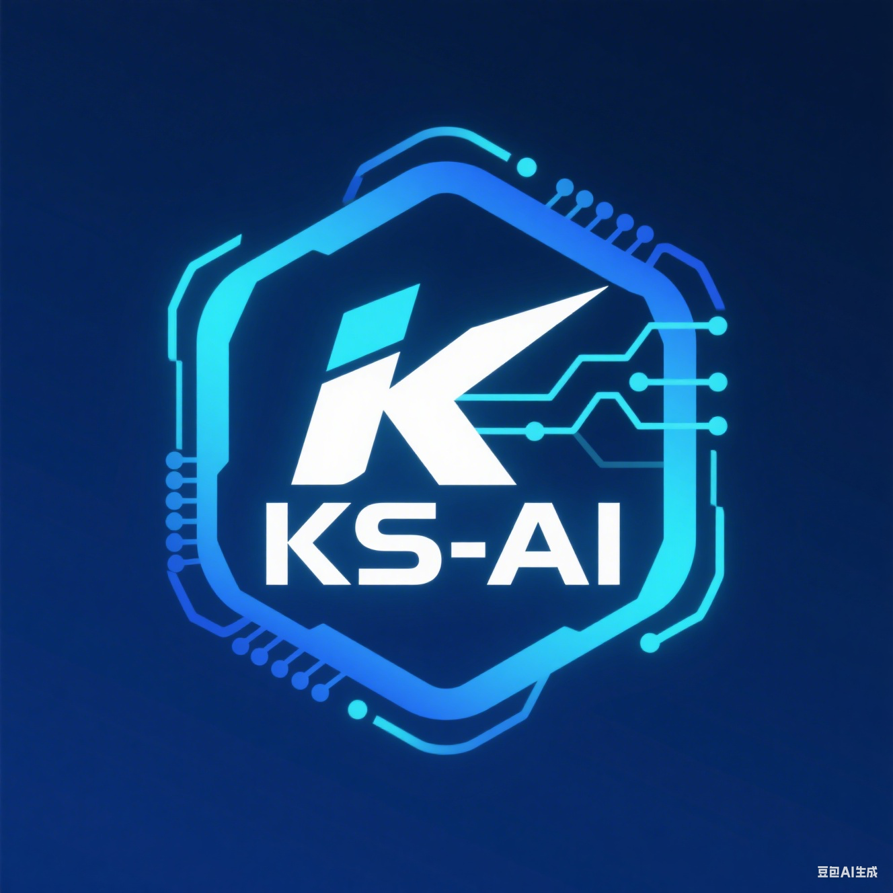

# KubeStack-AI

<p align="center">
  
</p>

<p align="center">
  <strong>AI驱动的Kubernetes与裸机环境统一中间件管理平台</strong>
</p>

<p align="center">
  <a href="https://github.com/turtacn/kubestack-ai/actions"></a>
  <a href="https://github.com/turtacn/kubestack-ai/blob/main/LICENSE"></a>
  <a href="https://github.com/turtacn/kubestack-ai/releases"></a>
  <a href="https://goreportcard.com/report/github.com/turtacn/kubestack-ai"></a>
  <a href="https://codecov.io/gh/turtacn/kubestack-ai"></a>
</p>

<p align="center">
  <a href="README.md">English</a> •
  <a href="docs/architecture.md">架构设计</a> •
  <a href="docs/contributing.md">贡献指南</a> •
  <a href="docs/plugins.md">插件开发</a>
</p>

---

## 🚀 项目使命

KubeStack-AI 是一个革命性的AI驱动命令行助手，彻底改变您在Kubernetes和裸机环境中诊断、管理和优化整个中间件技术栈的方式。通过结合大语言模型的强大能力与深度中间件专业知识，KubeStack-AI为复杂的云原生基础设施提供智能化、自然语言驱动的运维操作。


## 🎯 为什么选择KubeStack-AI？

### 面临的挑战
现代云原生环境涉及数十个中间件组件（Redis、Kafka、PostgreSQL、MinIO、ElasticSearch等），每个都有独特的运维复杂性。传统方法需要：

- **工具分散**: 每个中间件都需要不同的CLI工具
- **深度专业知识**: 需要掌握每个系统的内部机制
- **手动关联**: 需要在多个系统间手动关联问题症状
- **耗时诊断**: 复杂问题的故障排查需要数小时

### 我们的解决方案
KubeStack-AI提供**统一的AI驱动界面**，实现：

✅ **自然语言交互**: 用自然语言查询替代复杂命令  
✅ **整体思考**: 跨中间件关联和根因分析  
✅ **智能行动**: AI驱动的诊断和可执行建议  
✅ **无缝扩展**: 支持任意中间件的插件架构  
✅ **安全操作**: 关键操作的交互式确认  

## ⭐ 核心特性

### 🔍 **智能诊断**
- **多层分析**: 系统层、Kubernetes层和中间件专用检查
- **AI驱动根因分析**: 复杂分布式系统的根因分析
- **自然语言查询**: 用简单英语提问

### 🛠️ **通用中间件支持**
- **数据库系统**: MySQL、PostgreSQL、MongoDB、Redis、ClickHouse
- **消息队列**: Kafka、RabbitMQ、Pulsar
- **搜索和分析**: ElasticSearch、OpenSearch
- **存储**: MinIO、Ceph
- **监控**: Prometheus、Grafana
- **服务发现**: etcd、Consul

### 🧩 **插件架构**
- **可扩展设计**: 通过插件添加任意中间件支持
- **社区驱动**: 开放的插件生态系统
- **热插拔**: 无需停机即可安装、更新和移除插件

### 🤖 **AI增强运维**
- **智能建议**: 上下文感知的优化建议  
- **自动修复**: 常见问题的一键解决
- **知识集成**: 内置最佳实践和故障排查指南

## 🚀 快速开始

要快速设置，请参阅我们的 **[快速入门指南](QUICKSTART.md)**。

### 安装方式

#### 选项1: Go Install
```bash
go install github.com/turtacn/kubestack-ai/cmd/ksa@latest
````

#### 选项2: Homebrew (macOS/Linux)

```bash
brew tap turtacn/kubestack-ai
brew install kubestack-ai
```

#### 选项3: 下载二进制文件

访问我们的[发布页面](https://github.com/turtacn/kubestack-ai/releases)下载预构建的二进制文件。

### 快速上手

```bash
# 初始化 KubeStack-AI
ksa init

# 诊断当前命名空间中的所有中间件
ksa diagnose --all

# 自然语言提问
ksa ask "为什么我的Redis集群很慢？"

# 获取特定中间件状态
ksa status redis --namespace production

# 列出可用插件
ksa plugin list

# 安装新插件
ksa plugin install mongodb
```

### 基本使用示例

#### 示例1: 综合系统健康检查

```bash
$ ksa diagnose --middleware redis,mysql,kafka
🔍 正在分析Redis集群...
✅ Redis: 健康 (3/3节点正常，内存使用率: 45%)

🔍 正在分析MySQL主从结构...
⚠️  MySQL: 发现警告
   • 从库延迟: 2.3秒 (阈值: 1秒)
   • 慢查询: 最近一小时23个

🔍 正在分析Kafka集群...
❌ Kafka: 发现严重问题
   • Topic 'orders': 积压50K消息
   • 消费者组 'payment-service': 延迟5分钟

💡 AI建议:
   1. MySQL: 考虑调整innodb_buffer_pool_size参数
   2. Kafka: 扩展消费者组或检查处理逻辑
```

#### 示例2: 自然语言故障排除

```bash
$ ksa ask "我的应用无法连接到数据库"
🤔 正在分析连接问题...

🔍 发现的问题:
   • PostgreSQL max_connections (100) 已达上限
   • 应用Pod连接池耗尽
   • 网络策略阻止了5432端口流量

🛠️  建议操作:
   1. 增加最大连接数: `ksa exec postgres --set max_connections=200`
   2. 扩展应用副本: `ksa scale app --replicas 5`
   3. 检查网络策略: `ksa network analyze postgres`

执行修复? [y/N]: 
```

#### 示例3: 插件管理

```bash
$ ksa plugin install clickhouse
📦 正在安装ClickHouse插件 v1.2.0...
✅ 插件安装成功

$ ksa diagnose clickhouse --cluster analytics
🔍 ClickHouse集群分析:
   • 合并队列: 145项 (偏高)
   • 查询延迟P95: 2.3秒
   • 磁盘使用率: shard-2上78%

💡 建议:
   • 考虑增加后台合并线程数
   • 归档'events'表中的旧分区
```

## 📖 文档

* [**架构概览**](docs/architecture.md) - 系统设计技术深度解析
* [**插件开发指南**](docs/plugins.md) - 构建您自己的中间件插件
* [**配置参考**](docs/configuration.md) - 完整配置选项
* [**故障排除指南**](docs/troubleshooting.md) - 常见问题和解决方案
* [**API参考**](docs/api.md) - REST API和SDK文档

## 🤝 贡献

我们欢迎社区贡献！KubeStack-AI由中间件专家为中间件专家打造。

### 如何贡献

1. **🐛 报告问题**: 发现了bug？[创建issue](https://github.com/turtacn/kubestack-ai/issues)
2. **💡 功能请求**: 有想法？[开始讨论](https://github.com/turtacn/kubestack-ai/discussions)
3. **🔧 代码贡献**: [Fork、开发并提交PR](docs/contributing.md)
4. **📝 文档**: 帮助改进我们的文档
5. **🧩 插件开发**: 为新中间件构建插件

### 开发环境设置

```bash
git clone https://github.com/turtacn/kubestack-ai.git
cd kubestack-ai
make dev-setup
make test
make build
```

详细指南请查看 [CONTRIBUTING.md](CONTRIBUTING.md)。

## 🏆 社区与支持

* **💬 讨论**: [GitHub Discussions](https://github.com/turtacn/kubestack-ai/discussions)
* **🐛 问题**: [GitHub Issues](https://github.com/turtacn/kubestack-ai/issues)
* **📧 邮箱**: [kubestack-ai@turtacn.com](mailto:kubestack-ai@turtacn.com)
* **🐦 Twitter**: [@KubeStackAI](https://twitter.com/KubeStackAI)

## 📜 许可证

KubeStack-AI 采用 [Apache License 2.0](LICENSE) 许可证。详情请查看 [LICENSE](LICENSE) 文件。

## 🌟 Star历史

[](https://star-history.com/#turtacn/kubestack-ai&Date)

---

<p align="center">
  由KubeStack-AI社区用❤️构建
</p>