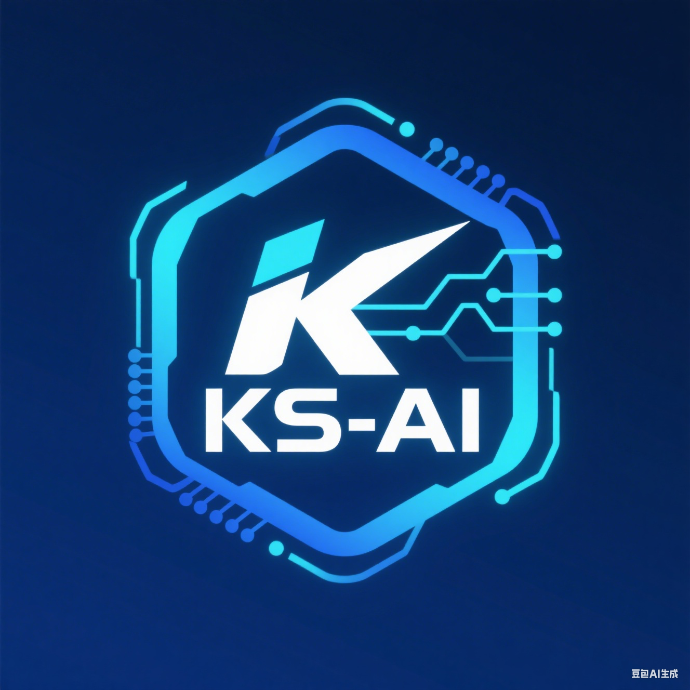
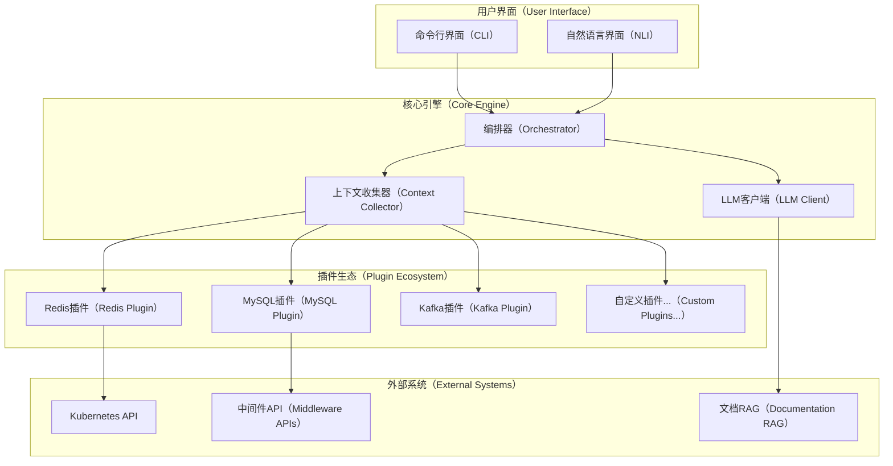
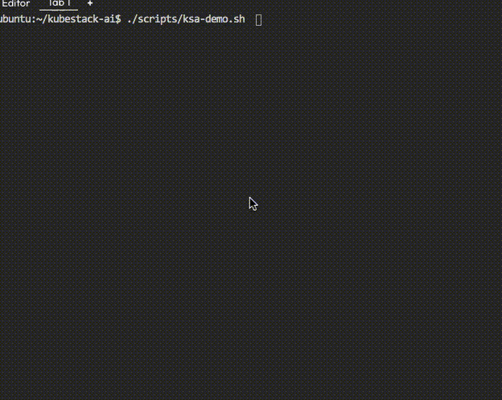

# KubeStack-AI



[](https://opensource.org/licenses/Apache-2.0)
[](https://golang.org)
[](https://github.com/turtacn/kubestack-ai/releases)

统一的、AI驱动的命令行助手，用于诊断、管理和优化运行在Kubernetes和裸机环境中的整个中间件堆栈。

[English](README.md) | 简体中文

## 🎯 项目使命

KubeStack-AI将复杂的中间件操作转化为自然语言交互，为云原生基础设施提供智能诊断、性能分析和自动化优化。它超越了单一工具助手，为管理Redis、Kafka、PostgreSQL、MinIO、MySQL、MongoDB、ClickHouse、Elasticsearch等提供了全面、可扩展和智能的界面。

KubeStack-AI效果：


## 🚀 为什么选择KubeStack-AI？

**现代基础设施的复杂性需要智能工具。** 传统中间件管理涉及：

* 学习数十种不同的CLI工具和API
* 在多个系统中关联日志、指标和配置
* 花费数小时诊断跨越多个中间件组件的问题
* 在不同环境中重复相同的故障排除模式

**KubeStack-AI通过以下方式解决这些问题：**

* **统一界面**：一个CLI工具管理所有中间件
* **AI驱动诊断**：自然语言查询配合智能分析
* **可扩展插件架构**：轻松集成新的中间件类型
* **跨组件分析**：关联整个堆栈中的问题
* **自动化修复**：安全地生成和执行修复命令

## ✨ 核心功能

### 🔍 智能诊断

* **多层分析**：系统、Kubernetes和中间件特定的健康检查
* **根本原因分析**：AI驱动的跨组件症状关联
* **性能瓶颈检测**：自动化性能分析和优化建议
* **安全与权限分析**：访问策略验证和冲突解决

### 🛠️ 自然语言操作

```bash
# 自然语言查询
ksa "我的Redis集群为什么很慢？"
ksa "检查所有MySQL实例的复制延迟"
ksa "为高吞吐量优化Kafka主题配置"

# 直接诊断
ksa diagnose redis --namespace production
ksa analyze postgres --performance --cluster maindb
ksa repair kafka --topic user-events --auto-confirm
```

### 🔌 可扩展插件系统

* **20+内置插件**：Redis、MySQL、PostgreSQL、Kafka、Elasticsearch、MongoDB、ClickHouse、MinIO、RabbitMQ、etcd、Prometheus等
* **简易插件开发**：自定义中间件集成的标准接口
* **热插拔**：无需停机即可安装、更新和移除插件
* **社区生态**：分享和发现社区贡献的插件

### 🤖 AI增强分析

* **RAG驱动知识库**：利用官方文档和最佳实践
* **上下文感知响应**：理解您的基础设施拓扑和历史
* **多模型支持**：支持GPT-4、Claude、Gemini和本地模型
* **运维学习**：基于您的环境改进建议

## 📦 安装

### 使用Go Install

```bash
go install github.com/turtacn/kubestack-ai/cmd/ksa@latest
```

### 使用Homebrew

```bash
brew tap turtacn/kubestack-ai
brew install kubestack-ai
```

### 使用Docker

```bash
docker run --rm -v ~/.kube:/root/.kube turtacn/kubestack-ai:latest diagnose redis
```

## 🚀 快速开始

1. **初始化KubeStack-AI**：

```bash
ksa init
```

2. **安装中间件插件**：

```bash
ksa plugin install redis mysql kafka postgres
```

3. **运行首次诊断**：

```bash
# 自然语言查询
ksa "检查我的Redis实例健康状况并提供优化建议"

# 结构化命令
ksa diagnose redis --namespace production --output json
```

4. **交互模式**：

```bash
ksa interactive
> 是什么导致我的PostgreSQL集群内存使用率高？
> 显示过去一小时的慢查询
> 生成性能调优计划
```

5. **安装插件**:  

```bash
# 查看可用插件
ksa list-plugins

# 安装MySQL插件
ksa install-plugin mysql

# 安装Redis插件
ksa install-plugin redis
```

6. **运行诊断**:

```bash
# 诊断MySQL实例
ksa diagnose --middleware mysql --namespace default --name mysql-0

# 诊断Redis集群
ksa diagnose --middleware redis --namespace redis-system --name redis-cluster

# 启用自动修复
ksa diagnose --middleware mysql --namespace default --name mysql-0 --auto-fix

# JSON输出
ksa diagnose --middleware redis --namespace default --name redis-0 --output json
```


## 📖 使用示例

### Redis诊断

```bash
# 全面的Redis健康检查
ksa diagnose redis --cluster redis-cluster --namespace production

# 内存优化分析
ksa analyze redis --memory --recommendations

# 自然语言故障排除
ksa "我的Redis内存不足，应该怎么办？"
```

### MySQL诊断示例

```bash
$ ksa diagnose --middleware mysql --namespace default --name mysql-primary

=== Diagnosis Report ===
Middleware: mysql
Environment: kubernetes
Overall Health: warning
Duration: 2340ms

Summary:
MySQL instance shows performance degradation with high connection usage (85%) and 
slow query accumulation. Buffer pool hit ratio is below optimal threshold.

Findings (3):
1. High Connection Usage [high]
   Detail: Connection usage is 170/200 (85.0%)
   Recommendations:
   1) Increase max_connections parameter [AUTO-FIXABLE]
   2) Optimize connection pooling in applications

2. High Slow Query Count [medium]  
   Detail: Found 342 slow queries
   Recommendations:
   1) Analyze slow query log and optimize queries
   2) Add appropriate indexes for slow queries

3. Low InnoDB Buffer Pool Hit Ratio [medium]
   Detail: Buffer pool hit ratio: 92.3% (recommended > 95%)
   Recommendations:
   1) Increase innodb_buffer_pool_size

=== End Report ===
```

### Redis诊断示例2

```bash
$ ksa diagnose --middleware redis --namespace redis-system --name redis-cluster-0

=== Diagnosis Report ===
Middleware: redis
Environment: kubernetes
Overall Health: healthy
Duration: 1850ms

Summary:
Redis instance is operating within normal parameters with good memory utilization
and connection management. Minor optimization opportunities identified.

Findings (1):
1. High Slow Operation Count [low]
   Detail: Found 23 slow operations in recent history
   Recommendations:
   1) Analyze slow operations and optimize commands
   2) Consider using pipelining for batch operations

=== End Report ===
```


### 多组件分析

```bash
# 分析整个堆栈健康状况
ksa diagnose --all --namespace production

# 跨组件性能分析
ksa analyze --components redis,postgres,kafka --performance

# 自然语言复杂查询
ksa "PostgreSQL升级后Kafka消费者为什么出现延迟？"
```

### 自动化修复

```bash
# 安全的自动化修复
ksa repair mysql --replication-lag --dry-run
ksa repair kafka --under-replicated-partitions --auto-confirm

# 交互式修复生成
ksa "生成命令来修复我的Elasticsearch黄色集群状态"
```

## 🏗️ 架构概览

KubeStack-AI采用模块化、基于插件的架构，专为可扩展性和可靠性而设计。详细技术信息请参阅我们的[架构文档](docs/architecture.md)。


```mermaid
graph TB
    subgraph "用户界面（User Interface）"
        CLI[命令行界面（CLI）]
        NLI[自然语言界面（NLI）]
    end
    
    subgraph "核心引擎（Core Engine）"
        ORCH[编排器（Orchestrator）]
        CTX[上下文收集器（Context Collector）]
        LLM[LLM客户端（LLM Client）]
    end
    
    subgraph "插件生态（Plugin Ecosystem）"
        REDIS[Redis插件（Redis Plugin）]
        MYSQL[MySQL插件（MySQL Plugin）]
        KAFKA[Kafka插件（Kafka Plugin）]
        CUSTOM[自定义插件...（Custom Plugins...）]
    end
    
    subgraph "外部系统（External Systems）"
        K8S[Kubernetes API]
        MW[中间件API（Middleware APIs）]
        DOCS[文档RAG（Documentation RAG）]
    end
    
    CLI --> ORCH
    NLI --> ORCH
    ORCH --> CTX
    ORCH --> LLM
    CTX --> REDIS
    CTX --> MYSQL
    CTX --> KAFKA
    CTX --> CUSTOM
    REDIS --> K8S
    MYSQL --> MW
    LLM --> DOCS
```

## 插件开发

### 创建自定义插件

```go
package myplugin

import (
    "context"
    "github.com/turtacn/kubestack-ai/internal/models"
    "github.com/turtacn/kubestack-ai/internal/plugins"
)

type MyPlugin struct {
    config plugins.PluginConfig
}

func (p *MyPlugin) Name() string {
    return "myplugin"
}

func (p *MyPlugin) Version() string {
    return "1.0.0"
}

func (p *MyPlugin) Initialize(config plugins.PluginConfig) error {
    p.config = config
    return nil
}

func (p *MyPlugin) Diagnose(ctx context.Context, target models.DiagnosticTarget) (*models.DiagnosisResult, error) {
    // 实现诊断逻辑 Implement diagnosis logic
    result := &models.DiagnosisResult{
        Middleware: "myplugin",
        // ... 其他字段 other fields
    }
    return result, nil
}

// 实现其他必需方法 Implement other required methods
```

### 插件注册

```go
func init() {
    plugins.Register("myplugin", func() plugins.Plugin {
        return &MyPlugin{}
    })
}
```

## 📸 演示

KubeStack-AI实际运行效果(CLI后端)：



*要自己生成此演示，请运行：[./scripts/ksa-demo.sh](./scripts/ksa-demo.sh)*

## 🤝 贡献

我们欢迎社区贡献！无论您是：

* **添加新的中间件插件**
* **改进AI分析能力**
* **增强文档**
* **报告错误或请求功能**

请查看我们的[贡献指南](CONTRIBUTING.md)了解详情：

* 开发环境设置
* 插件开发标准
* 代码审查流程
* 社区准则

### 快速开发设置

```bash
git clone https://github.com/turtacn/kubestack-ai.git
cd kubestack-ai
make dev-setup
make test
```

## 📄 许可证

本项目基于Apache License 2.0许可证 - 详情请参阅[LICENSE](LICENSE)文件。

## 🔗 链接

* [文档](https://docs.kubestack-ai.io)
* [插件开发指南](docs/plugin-development.md)
* [API参考](docs/api-reference.md)
* [社区论坛](https://github.com/turtacn/kubestack-ai/discussions)
* [问题跟踪](https://github.com/turtacn/kubestack-ai/issues)

---

**如果KubeStack-AI帮助简化了您的基础设施管理，请为这个仓库加星⭐！**
