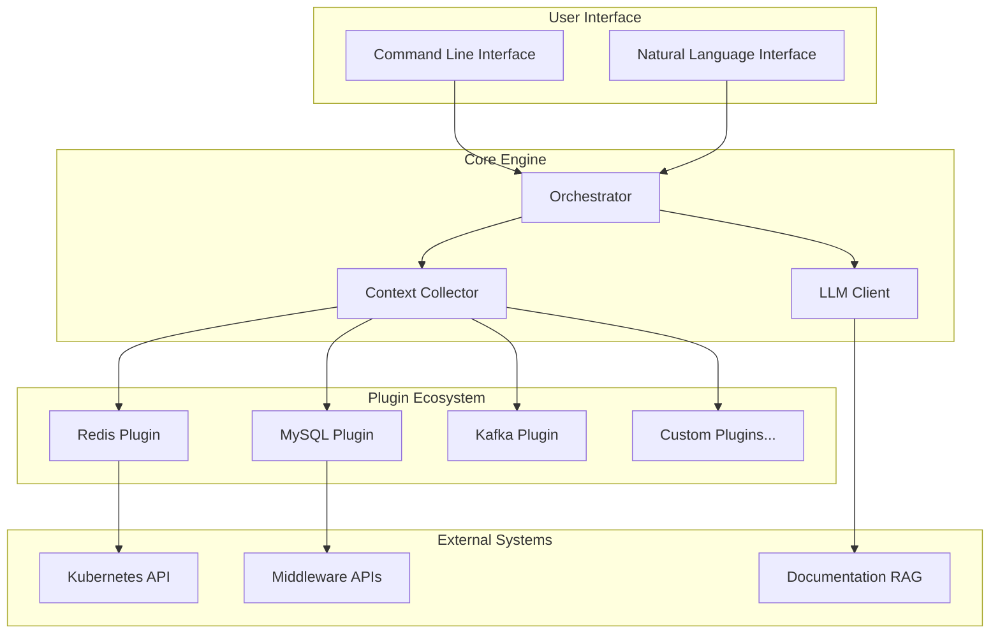

# KubeStack-AI


[](https://opensource.org/licenses/Apache-2.0)
[](https://golang.org)
[](https://github.com/turtacn/kubestack-ai/releases)

A unified, AI-powered command-line assistant for diagnosing, managing, and optimizing the entire middleware stack running on Kubernetes and bare-metal environments.

[简体中文](README-zh.md) | English

## 🎯 Mission Statement

KubeStack-AI transforms complex middleware operations into natural language interactions, providing intelligent diagnostics, performance analysis, and automated optimization for cloud-native infrastructure. It moves beyond single-tool assistants to provide a holistic, extensible, and intelligent interface for managing Redis, Kafka, PostgreSQL, MinIO, MySQL, MongoDB, ClickHouse, Elasticsearch, and more.

## 🚀 Why KubeStack-AI?

**Modern infrastructure complexity demands intelligent tooling.** Traditional middleware management involves:

* Learning dozens of different CLI tools and APIs
* Correlating logs, metrics, and configurations across multiple systems
* Spending hours diagnosing issues that span multiple middleware components
* Repeating the same troubleshooting patterns across different environments

**KubeStack-AI solves this by:**

* **Unified Interface**: One CLI tool to manage all your middleware
* **AI-Powered Diagnostics**: Natural language queries with intelligent analysis
* **Extensible Plugin Architecture**: Easy integration of new middleware types
* **Cross-Component Analysis**: Correlates issues across your entire stack
* **Automated Remediation**: Generates and executes fix commands safely

## ✨ Key Features

### 🔍 Intelligent Diagnostics

* **Multi-Layer Analysis**: System, Kubernetes, and middleware-specific health checks
* **Root Cause Analysis**: AI-powered correlation of symptoms across components
* **Performance Bottleneck Detection**: Automated profiling and optimization recommendations
* **Security & Permission Analysis**: Access policy validation and conflict resolution

### 🛠️ Natural Language Operations

```bash
# Natural language queries
ksa "Why is my Redis cluster slow?"
ksa "Check MySQL replication lag across all instances"
ksa "Optimize Kafka topic configurations for high throughput"

# Direct diagnostics
ksa diagnose redis --namespace production
ksa analyze postgres --performance --cluster maindb
ksa repair kafka --topic user-events --auto-confirm
```

### 🔌 Extensible Plugin System

* **20+ Built-in Plugins**: Redis, MySQL, PostgreSQL, Kafka, Elasticsearch, MongoDB, ClickHouse, MinIO, RabbitMQ, etcd, Prometheus, and more
* **Easy Plugin Development**: Standard interfaces for custom middleware integration
* **Hot-swappable**: Install, update, and remove plugins without downtime
* **Community Ecosystem**: Share and discover community-contributed plugins

### 🤖 AI-Enhanced Analysis

* **RAG-Powered Knowledge Base**: Leverages official documentation and best practices
* **Context-Aware Responses**: Understands your infrastructure topology and history
* **Multi-Model Support**: Works with GPT-4, Claude, Gemini, and local models
* **Learning from Operations**: Improves recommendations based on your environment

## 📦 Installation

### Using Go Install

```bash
go install github.com/turtacn/kubestack-ai/cmd/ksa@latest
```

### Using Homebrew

```bash
brew tap turtacn/kubestack-ai
brew install kubestack-ai
```

### Using Docker

```bash
docker run --rm -v ~/.kube:/root/.kube turtacn/kubestack-ai:latest diagnose redis
```

## 🚀 Quick Start

1. **Initialize KubeStack-AI**:

```bash
ksa init
```

2. **Install middleware plugins**:

```bash
ksa plugin install redis mysql kafka postgres
```

3. **Run your first diagnosis**:

```bash
# Natural language query
ksa "Check the health of my Redis instances and suggest optimizations"

# Structured command
ksa diagnose redis --namespace production --output json
```

4. **Interactive mode**:

```bash
ksa interactive
> What's causing high memory usage in my PostgreSQL cluster?
> Show me slow queries from the last hour
> Generate a performance tuning plan
```

## 📖 Usage Examples

### Redis Diagnostics

```bash
# Comprehensive Redis health check
ksa diagnose redis --cluster redis-cluster --namespace production

# Memory optimization analysis
ksa analyze redis --memory --recommendations

# Natural language troubleshooting
ksa "My Redis is running out of memory, what should I do?"
```

### Multi-Component Analysis

```bash
# Analyze entire stack health
ksa diagnose --all --namespace production

# Cross-component performance analysis
ksa analyze --components redis,postgres,kafka --performance

# Natural language complex query
ksa "Why are my Kafka consumers lagging behind after the PostgreSQL upgrade?"
```

### Automated Remediation

```bash
# Safe automated fixes
ksa repair mysql --replication-lag --dry-run
ksa repair kafka --under-replicated-partitions --auto-confirm

# Interactive fix generation
ksa "Generate commands to fix my Elasticsearch yellow cluster status"
```

## 🏗️ Architecture Overview

KubeStack-AI follows a modular, plugin-based architecture designed for extensibility and reliability. For detailed technical information, see our [Architecture Documentation](docs/architecture.md).



## 📸 Demo

Here's KubeStack-AI in action:


*To generate this demo yourself, run: `./scripts/ksa-demo.sh`*

## 🤝 Contributing

We welcome contributions from the community! Whether you're:

* **Adding new middleware plugins**
* **Improving AI analysis capabilities**
* **Enhancing documentation**
* **Reporting bugs or requesting features**

Please see our [Contributing Guide](CONTRIBUTING.md) for details on:

* Development setup
* Plugin development standards
* Code review process
* Community guidelines

### Quick Development Setup

```bash
git clone https://github.com/turtacn/kubestack-ai.git
cd kubestack-ai
make dev-setup
make test
```

## 📄 License

This project is licensed under the Apache License 2.0 - see the [LICENSE](LICENSE) file for details.

## 🔗 Links

* [Documentation](https://docs.kubestack-ai.io)
* [Plugin Development Guide](docs/plugin-development.md)
* [API Reference](docs/api-reference.md)
* [Community Forum](https://github.com/turtacn/kubestack-ai/discussions)
* [Issue Tracker](https://github.com/turtacn/kubestack-ai/issues)

---

**Star ⭐ this repo if KubeStack-AI helps simplify your infrastructure management!**