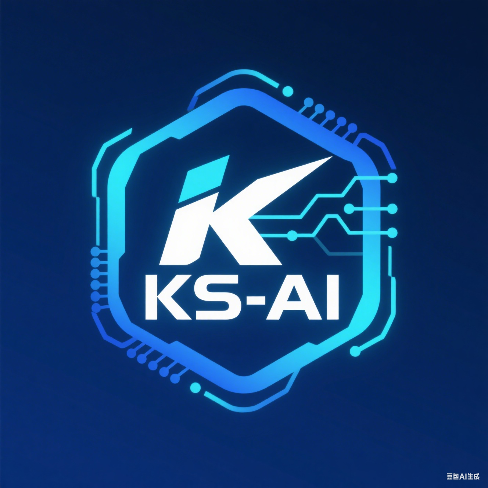

# KubeStack-AI 🚀

<div align="center">
  

**AI-Powered Kubernetes Middleware Management Platform**

[](https://github.com/turtacn/kubestack-ai/actions)
[](https://goreportcard.com/report/github.com/turtacn/kubestack-ai)
[](https://opensource.org/licenses/Apache-2.0)
[](https://github.com/turtacn/kubestack-ai/releases)
[](https://golang.org/)

</div>

## Mission Statement

KubeStack-AI is a revolutionary command-line assistant that brings artificial intelligence to Kubernetes middleware management. Instead of juggling multiple tools for Redis, Kafka, PostgreSQL, MinIO, and other services, KubeStack-AI provides a unified, intelligent interface that understands your problems in natural language and provides actionable solutions.

## Why KubeStack-AI? 🎯

**Problem:** Managing complex middleware stacks in Kubernetes requires expertise across multiple domains, tools, and troubleshooting approaches. Teams often struggle with:

* Context switching between different CLI tools
* Correlating issues across Kubernetes and application layers
* Manual diagnosis of complex, multi-service problems
* Inconsistent troubleshooting approaches across team members

**Solution:** KubeStack-AI unifies middleware management with AI-powered intelligence:

* **Single Interface:** One tool for all your middleware needs
* **Natural Language:** Describe problems as you would to a colleague
* **Intelligent Context:** Automatically gathers data from K8s and services
* **Actionable Insights:** Not just detection, but suggested fixes
* **Extensible Architecture:** Plugin-based system for any middleware

## Key Features ⭐

* 🤖 **AI-Powered Diagnostics**: Natural language problem description with intelligent analysis
* 🔌 **Plugin Architecture**: Extensible support for Redis, Kafka, PostgreSQL, MinIO, and more
* 🎯 **Unified Interface**: Single CLI for entire middleware stack management
* 📊 **Automated Context Collection**: Gathers K8s metrics, logs, and service-specific data
* 🔧 **Smart Repair Suggestions**: AI-analyzed solutions with optional auto-execution
* 📈 **Performance Optimization**: Proactive recommendations for better resource utilization
* 🔒 **Enterprise Ready**: RBAC support, audit logging, and security-first design

## Getting Started 🚀

### Installation

#### Using Go Install

```bash
go install github.com/turtacn/kubestack-ai/cmd/ksai@latest
```

#### Using Homebrew (macOS/Linux)

```bash
brew install turtacn/tap/kubestack-ai
```

#### Download Binary

Download the latest release from [GitHub Releases](https://github.com/turtacn/kubestack-ai/releases)

### Quick Start

1. **Configure your environment**:

```bash
# Configure your LLM provider (OpenAI, Claude, etc.)
ksai config set llm.provider openai
ksai config set llm.api-key YOUR_API_KEY

# Verify Kubernetes connection
ksai config verify
```

2. **Basic Usage Examples**:

```bash
# Natural language diagnosis
ksai diagnose "my redis pods are restarting frequently"

# Service-specific analysis
ksai analyze redis --namespace production

# Interactive repair with confirmation
ksai repair kafka --issue "consumer lag increasing" --confirm

# Health check across all middleware
ksai health-check --all-services
```

3. **Advanced Usage**:

```bash
# Multi-service correlation analysis
ksai diagnose "postgres queries slow and redis cache miss rate high"

# Automated monitoring setup
ksai setup monitoring --services redis,kafka,postgres

# Performance optimization recommendations
ksai optimize --namespace production --service-type database
```

## Supported Middleware 🛠️

| Service       | Status     | Plugin Version |
| ------------- | ---------- | -------------- |
| Redis         | ✅ Stable   | v1.0.0         |
| Kafka         | ✅ Stable   | v1.0.0         |
| PostgreSQL    | ✅ Stable   | v1.0.0         |
| MinIO         | 🚧 Beta    | v0.9.0         |
| MongoDB       | 📋 Planned | -              |
| Elasticsearch | 📋 Planned | -              |

## Contributing 🤝

We welcome contributions from the community! KubeStack-AI is designed to be extensible, and we're excited to see new plugins and features.

### Ways to Contribute

* 🐛 **Bug Reports**: Help us improve by reporting issues
* 💡 **Feature Requests**: Suggest new capabilities or middleware support
* 🔌 **Plugin Development**: Create plugins for new middleware services
* 📚 **Documentation**: Improve docs, tutorials, and examples
* 🧪 **Testing**: Help us test across different environments

### Getting Started with Development

```bash
git clone https://github.com/turtacn/kubestack-ai.git
cd kubestack-ai
make setup
make test
```

Read our [Contributing Guide](CONTRIBUTING.md) for detailed information.

## Documentation 📖

* [Architecture Overview](docs/architecture.md)
* [Plugin Development Guide](docs/plugins/developing-plugins.md)
* [User Guide](docs/user-guide/getting-started.md)
* [API Reference](docs/api/plugin-api.md)
* [Examples & Tutorials](docs/examples/)

## Community & Support 💬

* **GitHub Issues**: [Report bugs or request features](https://github.com/turtacn/kubestack-ai/issues)
* **Discussions**: [Community discussions and Q\&A](https://github.com/turtacn/kubestack-ai/discussions)
* **Discord**: [Join our community server](https://discord.gg/kubestack-ai) (coming soon)

## License 📄

This project is licensed under the Apache License 2.0 - see the [LICENSE](LICENSE) file for details.

## Acknowledgments 🙏

* The Kubernetes community for the incredible ecosystem
* All middleware project maintainers for building amazing tools
* Our contributors who make this project possible

---

<div align="center">
  Made with ❤️ by the KubeStack-AI community

[Website](https://kubestack-ai.dev) • [Documentation](https://docs.kubestack-ai.dev) • [Community](https://github.com/turtacn/kubestack-ai/discussions)

</div>