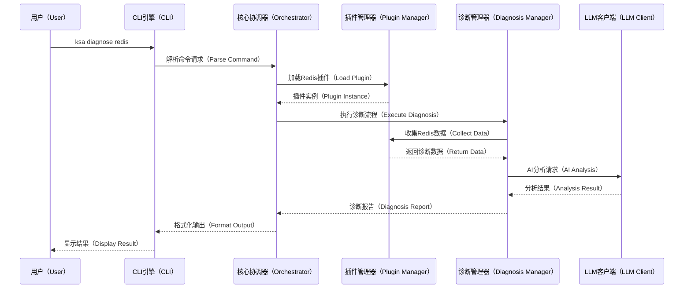
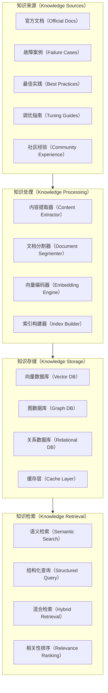
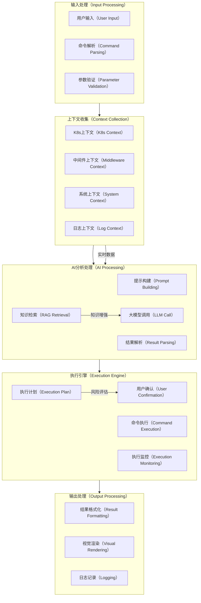
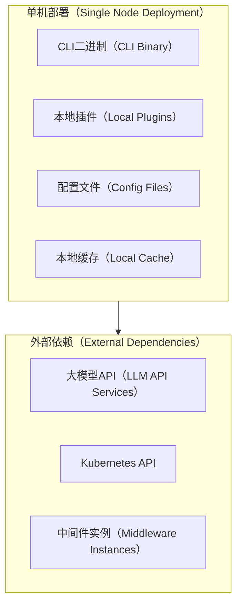
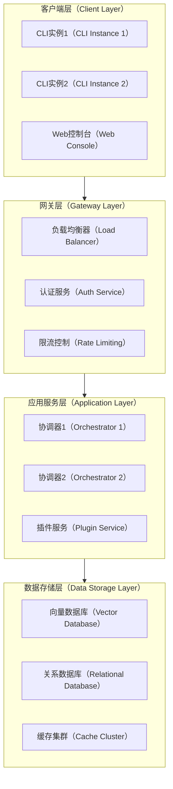
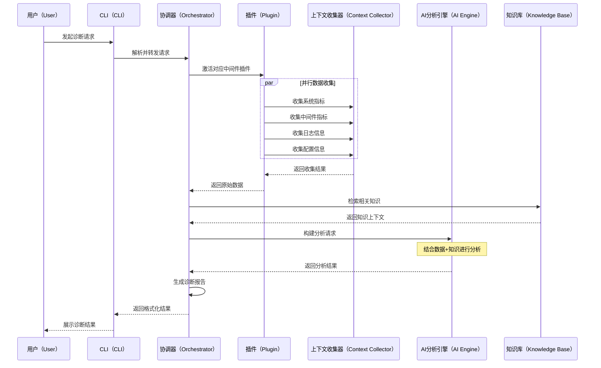
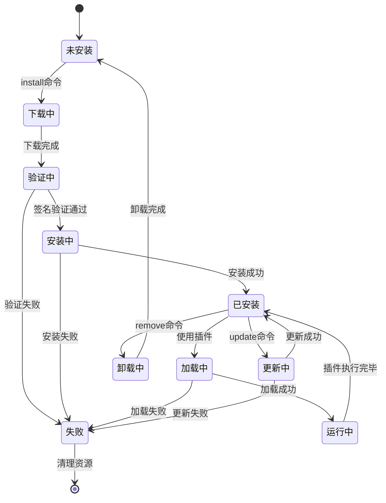

# KubeStack-AI 架构设计文档

## 概述（Overview）

KubeStack-AI 是一个面向云原生环境的AI驱动中间件运维管理平台，旨在通过自然语言交互、智能化诊断分析和自动化运维操作，解决现代分布式系统中中间件管理的复杂性挑战。该项目采用插件化架构设计，支持Kubernetes和裸机环境下的多种中间件技术栈的统一管理。

## 领域问题全景分析

### 当前中间件运维面临的核心挑战

在现代云原生环境中，企业通常需要管理数十种中间件组件，包括但不限于：数据库系统（MySQL、PostgreSQL、MongoDB、Redis）、消息队列（Kafka、RabbitMQ）、搜索引擎（Elasticsearch）、对象存储（MinIO）、监控系统（Prometheus）等。这些系统的运维管理存在以下关键痛点：

**1. 工具碎片化问题**
- 每个中间件都有独特的命令行工具和管理接口
- 运维人员需要掌握数十种不同的CLI工具和API
- 故障诊断时需要在多个工具间切换，效率低下

**2. 专业知识壁垒**
- 每个中间件都有复杂的配置参数和性能调优知识
- 故障排查需要深度的系统内部机制理解
- 跨系统关联分析需要丰富的运维经验

**3. 问题定位复杂性**
- 分布式系统中故障往往涉及多个组件的相互影响
- 缺乏统一的视图来关联不同中间件的状态信息
- 根因分析需要大量手动工作和经验判断

**4. 运维自动化程度低**
- 大量重复性的检查和修复工作仍需人工完成
- 缺乏智能化的问题预测和自动修复能力
- 最佳实践知识难以标准化和传承

## 解决方案全景

KubeStack-AI 通过以下核心设计理念来系统性解决上述挑战：

### 统一抽象层设计
通过标准化的插件接口，将不同中间件的管理操作抽象为统一的数据模型和操作接口，实现"一个CLI管理所有中间件"的目标。

### AI驱动的智能运维
集成大语言模型的强大推理能力，结合结构化的运维知识库，提供自然语言交互、智能诊断分析和自动化问题解决能力。

### 插件化扩展架构
采用高度模块化的插件系统，支持社区驱动的生态发展，确保平台能够快速适应新技术栈和特定需求。

### 多环境适配能力
同时支持Kubernetes容器环境和传统裸机/虚拟机环境，提供一致的用户体验和管理能力。

## 系统架构设计

### 整体架构图

```mermaid
graph TB
    %% 用户交互层
    subgraph UI[用户交互层（User Interface Layer）]
        CLI[命令行接口（CLI Engine）]
        API[REST API接口（REST API）]
        WEB[Web控制台（Web Console）]
    end

    %% 应用服务层
    subgraph AS[应用服务层（Application Service Layer）]
        CO[核心协调器（Core Orchestrator）]
        NLP[自然语言处理器（NLP Processor）]
        CMD[命令解析器（Command Parser）]
    end

    %% 核心业务层
    subgraph BL[核心业务层（Business Logic Layer）]
        DM[诊断管理器（Diagnosis Manager）]
        PM[插件管理器（Plugin Manager）]
        EM[执行管理器（Execution Manager）]
        KM[知识管理器（Knowledge Manager）]
    end

    %% 插件生态层
    subgraph PL[插件生态层（Plugin Ecosystem）]
        DB[数据库插件（Database Plugins）]
        MQ[消息队列插件（Message Queue Plugins）]
        ST[存储插件（Storage Plugins）]
        MO[监控插件（Monitoring Plugins）]
    end

    %% 基础设施层
    subgraph IL[基础设施层（Infrastructure Layer）]
        CC[上下文收集器（Context Collector）]
        LLM[大模型客户端（LLM Client）]
        RAG[知识检索系统（RAG System）]
        KB[知识库（Knowledge Base）]
    end

    %% 外部系统
    subgraph ES[外部系统（External Systems）]
        K8S[Kubernetes API]
        MW[中间件实例（Middleware Instances）]
        AI[AI模型服务（AI Model Services）]
    end

    %% 连接关系
    UI --> AS
    AS --> BL
    BL --> PL
    BL --> IL
    IL --> ES
    PL --> IL
````

### 核心组件详细设计

#### 1. 命令行接口（CLI Engine）

CLI引擎基于Cobra框架构建，提供统一的命令行交互入口：

```mermaid
graph LR
    %% CLI命令结构
    subgraph CLI[CLI命令结构（CLI Command Structure）]
        ROOT[ksa根命令（Root Command）]
        DIAG[diagnose诊断（Diagnose）]
        ASK[ask询问（Ask）]
        STAT[status状态（Status）]
        PLUG[plugin插件（Plugin）]
        FIX[fix修复（Fix）]
        CONF[config配置（Config）]
    end

    %% 命令参数
    ROOT --> DIAG
    ROOT --> ASK
    ROOT --> STAT
    ROOT --> PLUG
    ROOT --> FIX
    ROOT --> CONF

    DIAG --> |--middleware| MW_LIST[中间件列表（Middleware List）]
    DIAG --> |--namespace| NS[命名空间（Namespace）]
    DIAG --> |--all| ALL[全部检查（All Check）]

    ASK --> |自然语言查询| NL_QUERY[自然语言查询（Natural Language Query）]

    PLUG --> |install/list/remove| PLUG_OPS[插件操作（Plugin Operations）]
```

#### 2. 核心协调器（Core Orchestrator）

协调器是系统的中央控制组件，负责请求分发和流程控制：



#### 3. 插件管理器（Plugin Manager）

插件管理器负责插件的生命周期管理和标准化接口：

**插件接口定义：**

```go
type MiddlewarePlugin interface {
    // 插件基本信息
    Name() string
    Version() string
    SupportedVersions() []string
    
    // 核心功能接口
    Diagnose(ctx context.Context, config *DiagnosisConfig) (*DiagnosisResult, error)
    CollectMetrics(ctx context.Context) (*MetricsData, error)
    CollectLogs(ctx context.Context, opts *LogOptions) (*LogData, error)
    GetConfiguration(ctx context.Context) (*ConfigData, error)
    
    // 修复操作接口
    CanAutoFix(issue *Issue) bool
    ExecuteFix(ctx context.Context, fix *FixAction) (*FixResult, error)
    
    // 健康检查接口
    HealthCheck(ctx context.Context) (*HealthStatus, error)
}
```

### 知识库与RAG系统详细设计

#### 知识库架构设计

KubeStack-AI的知识库系统是提升AI分析能力的核心组件，采用多层次、结构化的知识存储和检索机制：



#### 具体实现策略

**1. 知识内容分类与结构化**

| 知识类型 | 数据格式          | 存储方式  | 检索策略    |
| ---- | ------------- | ----- | ------- |
| 官方文档 | Markdown/HTML | 向量化存储 | 语义相似度检索 |
| 故障案例 | JSON结构化       | 图数据库  | 症状匹配查询  |
| 配置参数 | YAML/JSON     | 关系数据库 | 精确匹配查询  |
| 最佳实践 | 半结构化文本        | 混合存储  | 标签+语义检索 |
| 性能基准 | 时序数据          | 时序数据库 | 范围查询    |

**2. 知识获取与更新机制**

```mermaid
flowchart LR
    %% 自动化知识获取流程
    subgraph AUTO[自动化获取（Auto Acquisition）]
        CRAWL[爬虫系统（Web Crawler）]
        API[API集成（API Integration）]
        RSS[RSS订阅（RSS Feeds）]
        GIT[Git仓库监控（Git Monitoring）]
    end

    %% 内容处理流程
    subgraph PROC[内容处理（Content Processing）]
        CLEAN[内容清洗（Content Cleaning）]
        VALID[内容验证（Content Validation）]
        STRUCT[结构化处理（Structuring）]
        EMBED[向量化编码（Embedding）]
    end

    %% 质量控制
    subgraph QC[质量控制（Quality Control）]
        HUMAN[人工审核（Human Review）]
        AUTO_CHECK[自动检查（Auto Check）]
        VER[版本控制（Version Control）]
        CONF[置信度评分（Confidence Scoring）]
    end

    AUTO --> PROC
    PROC --> QC
    QC -->|更新知识库| KB[知识库（Knowledge Base）]
```



**3. 上下文感知的知识检索**

RAG系统采用多阶段检索策略：

* **第一阶段：粗召回（Coarse Retrieval）**

  * 基于问题关键词进行向量检索
  * 返回Top-K个候选知识片段
  * 使用预训练的embedding模型进行相似度计算

* **第二阶段：精细重排（Fine Reranking）**

  * 结合当前中间件类型、环境信息进行上下文过滤
  * 使用交叉编码器模型进行相关性重新排序
  * 考虑知识的时效性和权威性

* **第三阶段：知识融合（Knowledge Fusion）**

  * 将检索到的多个知识片段进行整合
  * 解决潜在的知识冲突和重复
  * 构建结构化的知识上下文

### 数据流设计



## 部署架构设计

### 单机部署模式



### 分布式部署模式



## 核心业务流程

### 诊断流程设计



### 插件生命周期管理



## 预期效果与技术展望

### 短期目标

1. **核心功能实现**

   * 基础CLI框架和插件系统
   * 主流中间件插件（MySQL、Redis、Kafka、Elasticsearch）
   * 基本的AI诊断能力

2. **用户体验优化**

   * 自然语言交互界面
   * 丰富的输出格式（表格、图表、颜色）
   * 交互式修复确认机制

3. **生态建设启动**

   * 插件开发文档和工具链
   * 社区贡献者招募
   * 基础知识库内容

### 中期目标

1. **智能化提升**

   * 高级根因分析能力
   * 预测性维护功能
   * 自动化修复扩展

2. **企业级特性**

   * 多租户支持
   * 权限控制系统
   * 审计日志功能

3. **生态繁荣**

   * 20+官方中间件插件
   * 社区贡献插件生态
   * 丰富的知识库内容

### 长期愿景

1. **行业标准化**

   * 成为中间件运维的事实标准
   * 推动运维智能化行业发展
   * 建立开放的生态联盟

2. **技术创新**

   * 多模态交互能力（语音、图像）
   * 边缘计算部署支持
   * 量子计算优化探索

## 技术实现要点

### 性能优化策略

1. **并发处理**

   * 插件并行执行
   * 异步数据收集
   * 流式结果处理

2. **缓存机制**

   * 智能缓存策略
   * 分布式缓存支持
   * 缓存失效管理

3. **资源管理**

   * 内存池化
   * 连接池管理
   * 优雅降级机制

### 安全性保障

1. **插件安全**

   * 代码签名验证
   * 沙箱执行环境
   * 权限最小化原则

2. **数据安全**

   * 敏感信息脱敏
   * 传输加密
   * 访问控制

3. **操作安全**

   * 危险操作确认
   * 操作审计日志
   * 回滚机制

### 可观测性设计

1. **日志系统**

   * 结构化日志格式
   * 分级日志管理
   * 日志聚合分析

2. **指标监控**

   * 关键性能指标
   * 业务指标追踪
   * 实时告警机制

3. **链路追踪**

   * 请求全链路追踪
   * 性能瓶颈定位
   * 依赖关系分析

## 参考资料

\[1] k8sgpt-ai项目 - [https://github.com/k8sgpt-ai/k8sgpt](https://github.com/k8sgpt-ai/k8sgpt)

\[2] kubectl-ai项目 - [https://github.com/GoogleCloudPlatform/kubectl-ai](https://github.com/GoogleCloudPlatform/kubectl-ai)

\[3] Kubernetes官方文档 - [https://kubernetes.io/docs/](https://kubernetes.io/docs/)

\[4] Go语言规范 - [https://golang.org/ref/spec](https://golang.org/ref/spec)

\[5] OpenAI API文档 - [https://platform.openai.com/docs](https://platform.openai.com/docs)

\[6] Cobra CLI框架 - [https://github.com/spf13/cobra](https://github.com/spf13/cobra)

\[7] 向量数据库技术 - [https://github.com/milvus-io/milvus](https://github.com/milvus-io/milvus)

\[8] 云原生安全最佳实践 - [https://kubernetes.io/docs/concepts/security/](https://kubernetes.io/docs/concepts/security/)

