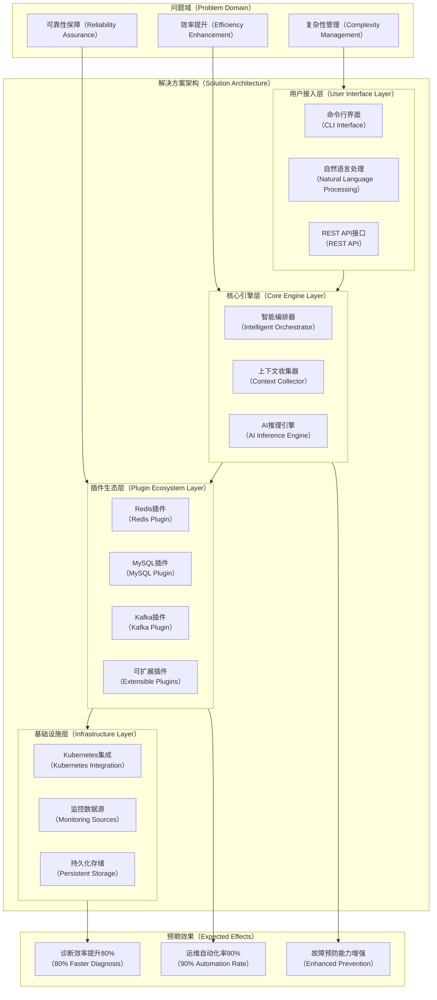
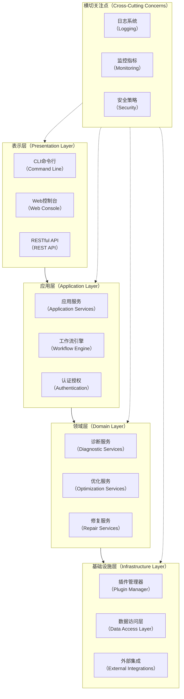
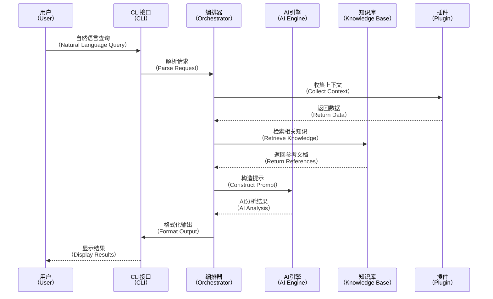
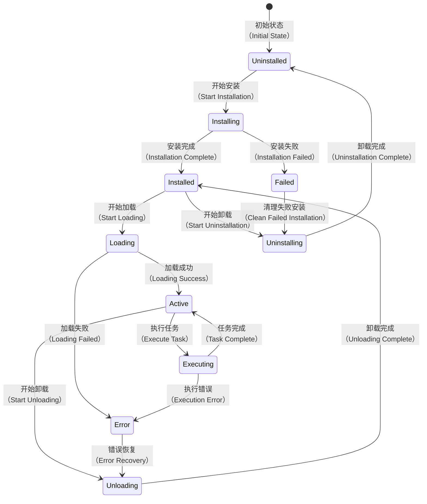
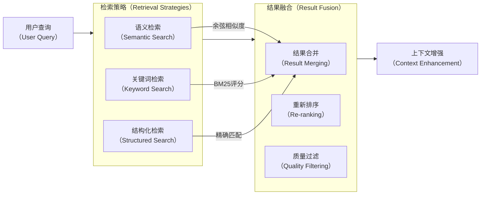
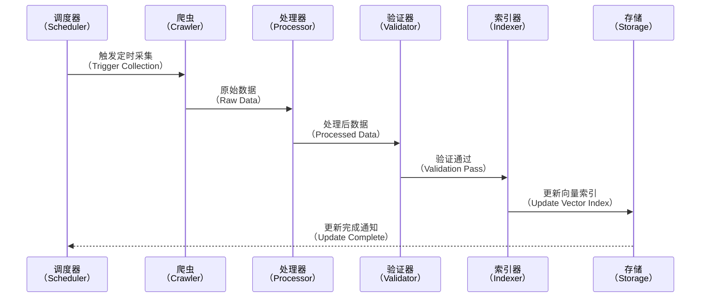
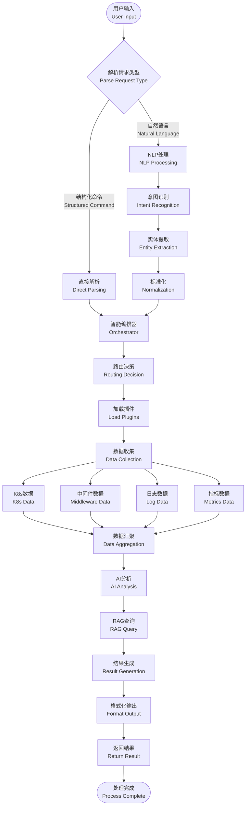
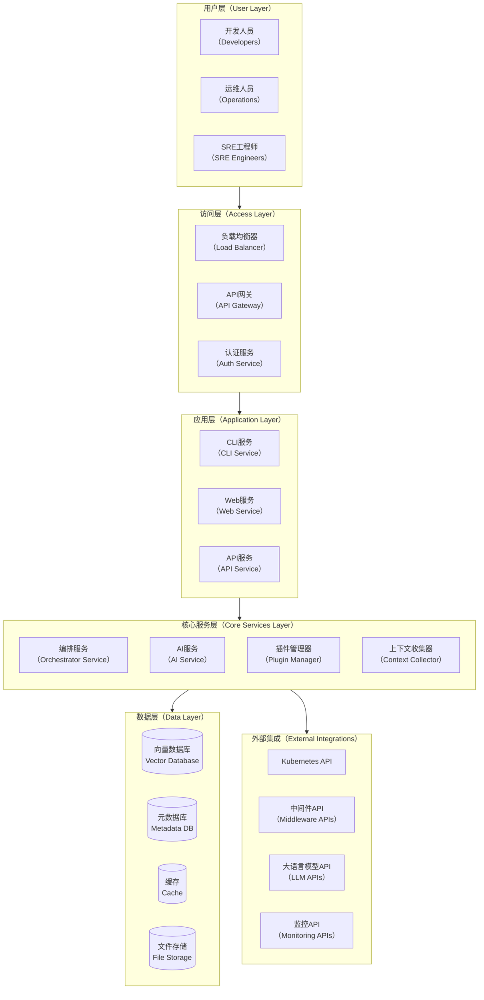

# KubeStack-AI 架构设计文档

## 概述

KubeStack-AI是一个革命性的AI驱动中间件运维平台，专为解决现代云原生基础设施中复杂的中间件管理挑战而设计。本文档详细阐述了项目的技术架构、设计决策和实现蓝图。

## 领域问题全景

### DFX问题挑战

现代企业基础设施面临的核心挑战包括：

**复杂性爆炸（Complexity Explosion）**：

* 单一应用栈可能涉及15-20种不同中间件
* 每种中间件有独特的监控、诊断和运维工具
* 跨组件问题排查需要专家级知识

**运维效率瓶颈（Operational Bottlenecks）**：

* 故障定位平均耗时2-4小时
* 重复性运维任务占用60%+工程师时间
* 知识孤岛导致依赖关键人员

**可靠性风险（Reliability Risks）**：

* 人工操作错误率高
* 缺乏统一的健康评估标准
* 预防性维护能力不足

### 解决方案全景

KubeStack-AI通过以下创新架构解决上述挑战：



## 系统架构

### 总体架构

KubeStack-AI采用分层式微服务架构，确保高可扩展性和可维护性：



### 核心组件详解

#### 智能编排器（Intelligent Orchestrator）

智能编排器是系统的控制中心，负责协调所有组件的工作：

* **请求路由**：将用户请求路由到合适的插件和服务
* **工作流管理**：编排复杂的多步骤诊断和修复流程
* **资源调度**：管理插件的加载、卸载和资源分配
* **错误恢复**：处理异常情况和故障恢复

#### 上下文收集器（Context Collector）

负责从各种数据源收集运行时上下文信息：

* **多源数据采集**：

  * Kubernetes API Server
  * 中间件特定API
  * 监控系统（Prometheus、Grafana）
  * 日志聚合系统
  * 配置管理工具

* **数据标准化**：将不同格式的数据转换为统一的内部格式

* **缓存机制**：优化数据访问性能，避免重复请求

* **实时更新**：支持数据的实时更新和变更通知

#### AI推理引擎（AI Inference Engine）

集成多种AI模型，提供智能分析能力：



### 插件架构设计

#### 插件接口标准

所有插件必须实现标准接口，确保系统的一致性和可扩展性：

```go
type MiddlewarePlugin interface {
    // 基础信息
    Name() string
    Version() string
    SupportedVersions() []string
    
    // 生命周期管理
    Initialize(config PluginConfig) error
    Validate() error
    Cleanup() error
    
    // 核心功能
    Diagnose(ctx context.Context, target DiagnosticTarget) (*DiagnosisResult, error)
    Analyze(ctx context.Context, metrics MetricsData) (*AnalysisResult, error)
    Repair(ctx context.Context, issue Issue) (*RepairResult, error)
    
    // 数据收集
    CollectMetrics(ctx context.Context) (*MetricsData, error)
    CollectLogs(ctx context.Context) ([]LogEntry, error)
    CollectConfig(ctx context.Context) (*ConfigData, error)
}
```

#### 插件生命周期管理




## 知识库与RAG系统详细设计

### 知识库架构

KubeStack-AI的知识库系统采用多层次、多模态的设计，为AI推理提供丰富的上下文信息：

```mermaid
graph TB
    %% 数据源层
    subgraph DS[数据源层（Data Sources Layer）]
        direction TB
        OFF[官方文档<br/>（Official Documentation）]
        COMM[社区知识<br/>（Community Knowledge）]
        BEST[最佳实践<br/>（Best Practices）]
        CASE[案例库<br/>（Case Studies）]
    end

    %% 预处理层
    subgraph PP[预处理层（Preprocessing Layer）]
        direction TB
        CRAWL[爬虫系统<br/>（Web Crawler）]
        PARSE[解析器<br/>（Parser）]
        CLEAN[数据清洗<br/>（Data Cleaning）]
        VALID[质量验证<br/>（Quality Validation）]
    end

    %% 向量化层
    subgraph VL[向量化层（Vectorization Layer）]
        direction TB
        CHUNK[文档分块<br/>（Document Chunking）]
        EMBED[嵌入生成<br/>（Embedding Generation）]
        INDEX[索引构建<br/>（Index Building）]
        STORE[向量存储<br/>（Vector Storage）]
    end

    %% 检索层
    subgraph RL[检索层（Retrieval Layer）]
        direction TB
        QUERY[查询理解<br/>（Query Understanding）]
        MATCH[语义匹配<br/>（Semantic Matching）]
        RANK[相关性排序<br/>（Relevance Ranking）]
        FILTER[结果过滤<br/>（Result Filtering）]
    end

    %% 数据流
    DS --> PP
    PP --> VL
    VL --> RL
    
    %% 外部集成
    EXT1[GitHub API] --> CRAWL
    EXT2[文档站点<br/>（Doc Sites）] --> CRAWL
    EXT3[Stack Overflow] --> CRAWL
    EXT4[Reddit社区<br/>（Reddit Community）] --> CRAWL
````

### 多源数据采集策略

#### 官方文档采集

**Redis文档采集**：

* 来源：redis.io官方文档、GitHub Wiki
* 采集频率：每周更新
* 内容类型：配置参数、命令参考、故障排除指南
* 质量评分：基于官方权威性，评分9-10分

**MySQL文档采集**：

* 来源：dev.mysql.com、官方手册
* 采集频率：版本发布时更新
* 内容类型：性能调优、复制配置、故障诊断
* 质量评分：官方文档评分9-10分

**Kafka文档采集**：

* 来源：kafka.apache.org、Confluent文档
* 采集频率：每月更新
* 内容类型：集群管理、性能优化、监控指标
* 质量评分：Apache官方9-10分，Confluent 8-9分

#### 社区知识挖掘

**技术博客爬取**：

```python
# 示例爬虫配置
crawler_config = {
    "sources": [
        {
            "name": "高质量技术博客",
            "domains": ["medium.com", "dev.to", "hashnode.com"],
            "keywords": ["redis optimization", "mysql performance", "kafka troubleshooting"],
            "quality_threshold": 7.0,
            "update_frequency": "weekly"
        }
    ],
    "content_filters": {
        "min_length": 1000,
        "has_code_examples": True,
        "author_reputation": "verified"
    }
}
```

**Stack Overflow问答挖掘**：

* 高票答案（100+赞）优先收录
* 按中间件分类标签筛选
* 提取问题-解决方案对
* 质量评分基于投票数和采纳率

#### 案例库构建

**故障案例结构化存储**：

```json
{
  "case_id": "redis_memory_leak_001",
  "middleware": "redis",
  "category": "memory_management",
  "symptoms": [
    "内存使用持续增长",
    "响应时间变慢",
    "连接数异常"
  ],
  "root_cause": "大key导致的内存碎片",
  "solution_steps": [
    {
      "step": 1,
      "action": "识别大key",
      "command": "redis-cli --bigkeys"
    },
    {
      "step": 2,
      "action": "分析key结构",
      "command": "memory usage keyname"
    }
  ],
  "prevention": "定期监控key大小分布",
  "source_quality": 9.2,
  "verification_count": 15
}
```

### RAG检索优化

#### 混合检索策略



#### 上下文感知检索

**查询理解增强**：

* 识别中间件类型和版本
* 提取关键技术术语
* 理解问题严重程度
* 推断用户技术水平

**检索结果个性化**：

* 基于历史查询优化排序
* 考虑用户环境特征
* 动态调整内容深度
* 优先推荐验证过的解决方案

#### 知识库更新机制

**增量更新流水线**：



**质量保障机制**：

* 多源交叉验证
* 专家审核流程
* 用户反馈集成
* 自动化测试验证

### RAG效果提升技术

#### 检索质量优化

**查询扩展技术**：

* 同义词扩展：redis -> cache, in-memory database
* 技术术语映射：lag -> replication delay
* 上下文推理：MySQL慢查询 -> performance optimization

**文档分块优化**：

* 智能分块：保持语义完整性
* 重叠窗口：避免关键信息分割
* 层次结构：维护文档层级关系

#### 生成质量提升

**提示工程优化**：

```text
你是一个专业的{middleware}运维专家，具有10年以上的生产环境经验。

当前情况：
- 中间件类型：{middleware_type}
- 版本信息：{version_info}
- 环境信息：{environment_context}
- 用户查询：{user_query}

相关知识：
{retrieved_knowledge}

请基于上述信息，提供专业的分析和建议：
1. 问题诊断：准确识别问题根源
2. 解决方案：提供可执行的具体步骤
3. 预防措施：给出避免类似问题的建议
4. 风险评估：说明操作可能的风险和注意事项

回答应该：
- 技术准确，基于最佳实践
- 步骤清晰，便于执行
- 包含必要的命令和配置示例
- 考虑生产环境的安全性
```

## 数据流架构

### 请求处理流程



## 部署架构

### 标准部署模型



### 云原生部署

KubeStack-AI支持完全云原生部署，利用Kubernetes的各种特性：

**Helm Chart部署配置**：

```yaml
# values.yaml示例
deployment:
  replicas: 3
  strategy: RollingUpdate
  
resources:
  orchestrator:
    requests:
      cpu: 500m
      memory: 1Gi
    limits:
      cpu: 2000m
      memory: 4Gi
  
storage:
  vectorDB:
    size: 100Gi
    storageClass: fast-ssd
  
ai:
  provider: openai  # or azure, anthropic, local
  model: gpt-4
  maxTokens: 4000
  
plugins:
  autoInstall:
    - redis
    - mysql
    - kafka
    - postgres
  
monitoring:
  prometheus:
    enabled: true
  grafana:
    enabled: true
  jaeger:
    enabled: true
```

## 代码结构参考设计


```
kubestack-ai/
├── cmd/                           # 应用程序入口点
│   └── ksa/                      # CLI应用
├── internal/                     # 私有应用和库代码
│   ├── common/                   # 通用组件
│   │   ├── config/              # 配置管理
│   │   ├── logger/              # 日志系统
│   │   ├── errors/              # 错误定义
│   │   └── types/               # 通用类型定义
│   ├── core/                    # 核心业务逻辑
│   │   ├── orchestrator/        # 编排器
│   │   ├── collector/           # 上下文收集
│   │   ├── ai/                  # AI推理引擎
│   │   └── rag/                 # RAG系统
│   ├── plugins/                 # 插件系统
│   │   ├── interface/           # 插件接口定义
│   │   ├── manager/             # 插件管理器
│   │   ├── registry/            # 插件注册表
│   │   └── implementations/     # 具体插件实现
│   ├── cli/                     # CLI接口层
│   │   ├── commands/            # 命令定义
│   │   ├── handlers/            # 命令处理器
│   │   └── ui/                  # 用户界面
│   ├── api/                     # API接口层
│   │   ├── rest/                # REST API
│   │   └── grpc/                # gRPC API
│   └── infrastructure/          # 基础设施层
│       ├── database/            # 数据库访问
│       ├── cache/               # 缓存
│       ├── storage/             # 存储
│       └── external/            # 外部服务集成
├── pkg/                         # 公共库代码
│   ├── client/                  # 客户端库
│   └── utils/                   # 工具库
├── api/                         # API定义文件
│   ├── proto/                   # Protocol Buffer定义
│   └── openapi/                 # OpenAPI规范
├── configs/                     # 配置文件
├── docs/                        # 文档
├── scripts/                     # 脚本
├── test/                        # 测试文件
├── deployments/                 # 部署配置
├── build/                       # 构建配置
└── examples/                    # 示例
```