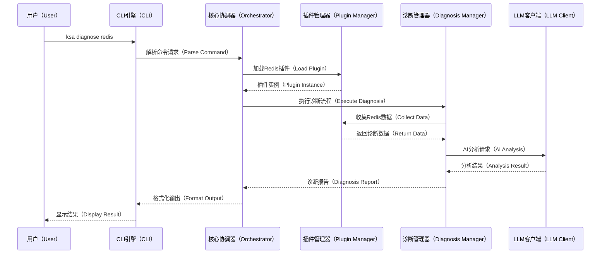
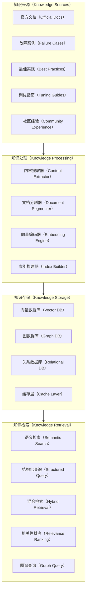
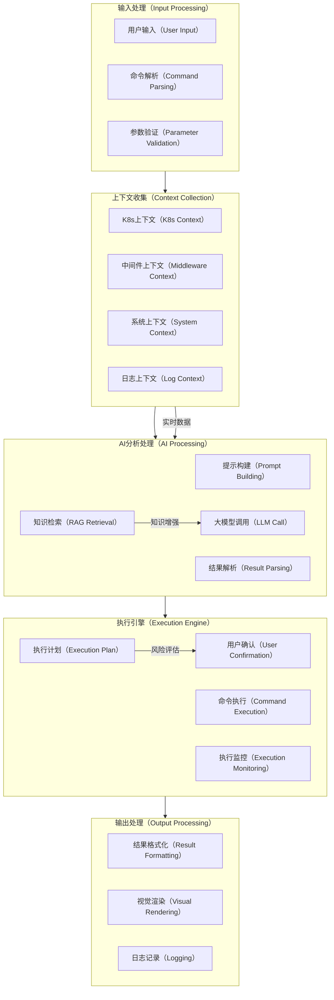
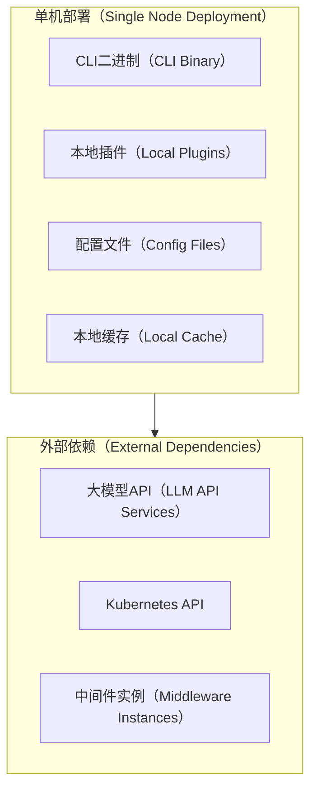
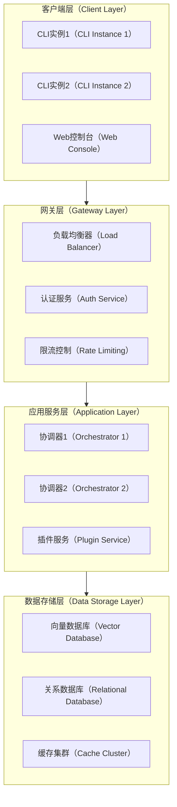
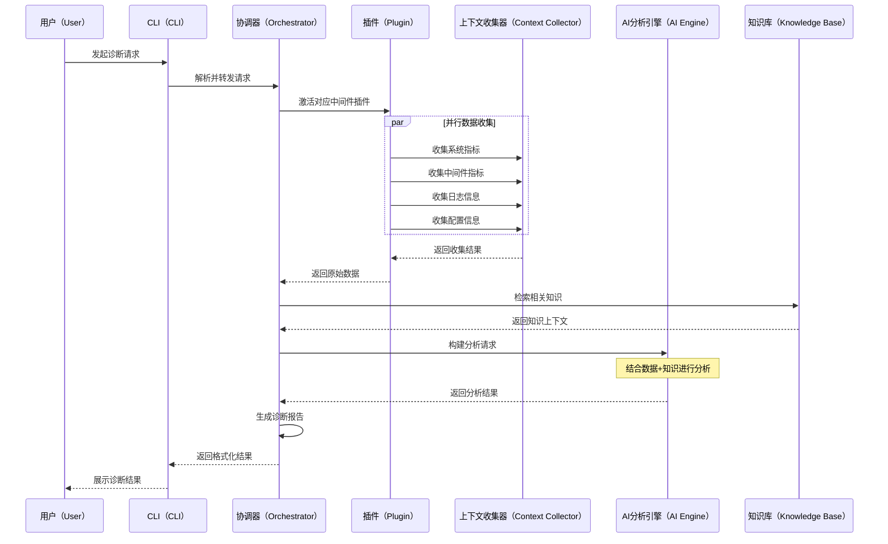
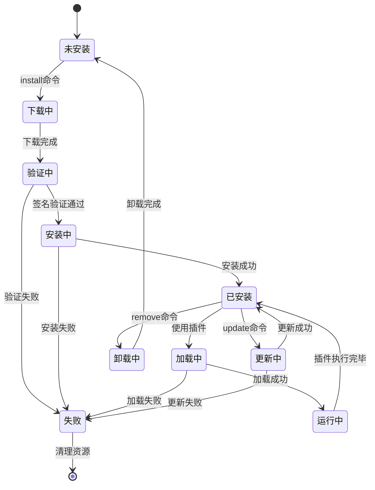

# KubeStack-AI 架构设计文档

## 概述（Overview）

KubeStack-AI 是一个面向云原生环境的AI驱动中间件运维管理平台，旨在通过自然语言交互、智能化诊断分析和自动化运维操作，解决现代分布式系统中中间件管理的复杂性挑战。该项目采用插件化架构设计，支持Kubernetes和裸机环境下的多种中间件技术栈的统一管理。

## 领域问题全景分析

### 当前中间件运维面临的核心挑战

在现代云原生环境中，企业通常需要管理数十种中间件组件，包括但不限于：数据库系统（MySQL、PostgreSQL、MongoDB、Redis）、消息队列（Kafka、RabbitMQ）、搜索引擎（Elasticsearch）、对象存储（MinIO）、监控系统（Prometheus）等。这些系统的运维管理存在以下关键痛点：

**1. 工具碎片化问题**
- 每个中间件都有独特的命令行工具和管理接口
- 运维人员需要掌握数十种不同的CLI工具和API
- 故障诊断时需要在多个工具间切换，效率低下

**2. 专业知识壁垒**
- 每个中间件都有复杂的配置参数和性能调优知识
- 故障排查需要深度的系统内部机制理解
- 跨系统关联分析需要丰富的运维经验

**3. 问题定位复杂性**
- 分布式系统中故障往往涉及多个组件的相互影响
- 缺乏统一的视图来关联不同中间件的状态信息
- 根因分析需要大量手动工作和经验判断

**4. 运维自动化程度低**
- 大量重复性的检查和修复工作仍需人工完成
- 缺乏智能化的问题预测和自动修复能力
- 最佳实践知识难以标准化和传承

## 解决方案全景

KubeStack-AI 通过以下核心设计理念来系统性解决上述挑战：

### 统一抽象层设计
通过标准化的插件接口，将不同中间件的管理操作抽象为统一的数据模型和操作接口，实现"一个CLI管理所有中间件"的目标。

### AI驱动的智能运维
集成大语言模型的强大推理能力，结合结构化的运维知识库，提供自然语言交互、智能诊断分析和自动化问题解决能力。

### 插件化扩展架构
采用高度模块化的插件系统，支持社区驱动的生态发展，确保平台能够快速适应新技术栈和特定需求。

### 多环境适配能力
同时支持Kubernetes容器环境和传统裸机/虚拟机环境，提供一致的用户体验和管理能力。

## 系统架构设计

### 整体架构图

```mermaid
graph TB
    %% 用户交互层
    subgraph UI[用户交互层（User Interface Layer）]
        CLI[命令行接口（CLI Engine）]
        API[REST API接口（REST API）]
        WEB[Web控制台（Web Console）]
    end

    %% 应用服务层
    subgraph AS[应用服务层（Application Service Layer）]
        CO[核心协调器（Core Orchestrator）]
        NLP[自然语言处理器（NLP Processor）]
        CMD[命令解析器（Command Parser）]
    end

    %% 核心业务层
    subgraph BL[核心业务层（Business Logic Layer）]
        DM[诊断管理器（Diagnosis Manager）]
        PM[插件管理器（Plugin Manager）]
        EM[执行管理器（Execution Manager）]
        KM[知识管理器（Knowledge Manager）]
    end

    %% 插件生态层
    subgraph PL[插件生态层（Plugin Ecosystem）]
        DB[数据库插件（Database Plugins）]
        MQ[消息队列插件（Message Queue Plugins）]
        ST[存储插件（Storage Plugins）]
        MO[监控插件（Monitoring Plugins）]
    end

    %% 基础设施层
    subgraph IL[基础设施层（Infrastructure Layer）]
        CC[上下文收集器（Context Collector）]
        LLM[大模型客户端（LLM Client）]
        RAG[知识检索系统（RAG System）]
        KB[知识库（Knowledge Base）]
    end

    %% 外部系统
    subgraph ES[外部系统（External Systems）]
        K8S[Kubernetes API]
        MW[中间件实例（Middleware Instances）]
        AI[AI模型服务（AI Model Services）]
    end

    %% 连接关系
    UI --> AS
    AS --> BL
    BL --> PL
    BL --> IL
    IL --> ES
    PL --> IL
````

### 核心组件详细设计

#### 1. 命令行接口（CLI Engine）

CLI引擎基于Cobra框架构建，提供统一的命令行交互入口：

```mermaid
graph LR
    %% CLI命令结构
    subgraph CLI[CLI命令结构（CLI Command Structure）]
        ROOT[ksa根命令（Root Command）]
        DIAG[diagnose诊断（Diagnose）]
        ASK[ask询问（Ask）]
        STAT[status状态（Status）]
        PLUG[plugin插件（Plugin）]
        FIX[fix修复（Fix）]
        CONF[config配置（Config）]
    end

    %% 命令参数
    ROOT --> DIAG
    ROOT --> ASK
    ROOT --> STAT
    ROOT --> PLUG
    ROOT --> FIX
    ROOT --> CONF

    DIAG --> |--middleware| MW_LIST[中间件列表（Middleware List）]
    DIAG --> |--namespace| NS[命名空间（Namespace）]
    DIAG --> |--all| ALL[全部检查（All Check）]

    ASK --> |自然语言查询| NL_QUERY[自然语言查询（Natural Language Query）]

    PLUG --> |install/list/remove| PLUG_OPS[插件操作（Plugin Operations）]
```

#### 2. 核心协调器（Core Orchestrator）

协调器是系统的中央控制组件，负责请求分发和流程控制：



#### 3. 插件管理器（Plugin Manager）

插件管理器负责插件的生命周期管理和标准化接口：

**插件接口定义：**

```go
type MiddlewarePlugin interface {
    // 插件基本信息
    Name() string
    Version() string
    SupportedVersions() []string
    
    // 核心功能接口
    Diagnose(ctx context.Context, config *DiagnosisConfig) (*DiagnosisResult, error)
    CollectMetrics(ctx context.Context) (*MetricsData, error)
    CollectLogs(ctx context.Context, opts *LogOptions) (*LogData, error)
    GetConfiguration(ctx context.Context) (*ConfigData, error)
    
    // 修复操作接口
    CanAutoFix(issue *Issue) bool
    ExecuteFix(ctx context.Context, fix *FixAction) (*FixResult, error)
    
    // 健康检查接口
    HealthCheck(ctx context.Context) (*HealthStatus, error)
}
```

#### 实现现状与契约适配层（Implementation Status & Contract Adapter Layer）

**设计与实现对齐策略**

在实际实现过程中，系统存在两套插件接口：
1. **设计契约接口** (`internal/core/contracts/middleware_plugin.go`) - 上述面向诊断的设计接口
2. **实现接口** (`internal/plugin/interface.go`) - 现有的面向操作的实现接口

现有插件实现采用的是操作型接口，包含以下方法：
- `Connect/Disconnect/Ping/IsConnected` - 连接管理
- `Execute/SupportedCommands` - 命令执行
- `CollectMetrics/CollectSpecificMetric` - 指标收集
- `GetDiagnosticData/GetBuiltinRules` - 诊断支持

**适配层设计**

为了在不破坏现有插件实现的前提下完成设计对齐，系统引入了适配器层 (`internal/core/contracts/adapter`)：

```go
// PluginAdapter 将现有的操作型插件适配为设计契约接口
type PluginAdapter struct {
    underlying plugin.MiddlewarePlugin
}

// 适配器负责以下映射：
// - Diagnose() → Connect() + GetDiagnosticData() + GetBuiltinRules()
// - CollectMetrics() → CollectMetrics()
// - CollectLogs() → GetDiagnosticData().SlowLogs
// - GetConfiguration() → GetDiagnosticData().Config
// - HealthCheck() → Ping()
// - ExecuteFix() → Execute(Command)
```

**实现边界与设计决策**

| 层次 | 职责 | 位置 | 说明 |
|------|------|------|------|
| **契约层** | 定义设计对齐的标准接口 | `internal/core/contracts/` | 面向诊断的API，供编排层使用 |
| **适配层** | 桥接契约与实现 | `internal/core/contracts/adapter/` | 无侵入式适配现有插件 |
| **实现层** | 现有插件实现 | `internal/plugin/`, `plugins/` | 操作型接口，维持现有代码稳定 |

**依赖收敛策略**

在Phase 01中，系统完成了Redis插件的依赖收敛：
- **规范实现**：`plugins/redis/` (使用 `github.com/go-redis/redis/v8`)
- **遗留实现**：`internal/plugin/redis_legacy/` (使用 `github.com/redis/go-redis/v9`，通过build tag排除)
- **决策依据**：主应用引用的是`plugins/redis`，因此将其作为规范实现

这种设计确保了：
- ✅ 现有插件代码无需修改即可工作
- ✅ 新的诊断流程使用统一的契约接口
- ✅ 为后续的AI+RAG增强提供了稳定的集成点
- ✅ 消除了依赖冲突和构建不确定性

### 知识库与RAG系统详细设计

#### 知识库架构设计

KubeStack-AI的知识库系统是提升AI分析能力的核心组件，采用多层次、结构化的知识存储和检索机制：



### 知识图谱模块设计

知识图谱是平台理解复杂系统依赖和故障传播的关键组件：

**1. 架构位置**
- 位于 `internal/knowledge/graph/`
- 与RAG系统协同工作，提供上下文增强

**2. 核心组件**
| 组件 | 职责 |
|------|------|
| GraphStore | 图存储抽象接口，支持内存(开发)和Neo4j(生产)实现 |
| Builder | 从Kubernetes集群资源和拓扑构建知识图谱 |
| QueryEngine | 提供依赖分析、影响追溯和根因定位的查询能力 |

**3. 数据模型**
- **节点(Node)**: Service, Middleware (Redis/MySQL/Kafka), Pod, Namespace
- **边(Edge)**:
  - `depends_on`: 服务依赖中间件
  - `connects_to`: 网络连接关系
  - `runs_on`: Pod运行在节点
  - `contains`: 命名空间包含服务
  - `replica_of`: 主从/副本关系

**4. 与RAG集成**
- 检索时融合图上下文，提供受影响组件信息
- 依赖链作为Prompt增强，帮助LLM理解系统全貌

#### 具体实现策略

**1. 知识内容分类与结构化**

| 知识类型 | 数据格式          | 存储方式  | 检索策略    |
| ---- | ------------- | ----- | ------- |
| 官方文档 | Markdown/HTML | 向量化存储 | 语义相似度检索 |
| 故障案例 | JSON结构化       | 图数据库  | 症状匹配查询  |
| 配置参数 | YAML/JSON     | 关系数据库 | 精确匹配查询  |
| 最佳实践 | 半结构化文本        | 混合存储  | 标签+语义检索 |
| 性能基准 | 时序数据          | 时序数据库 | 范围查询    |

**2. 知识获取与更新机制**

```mermaid
flowchart LR
    %% 自动化知识获取流程
    subgraph AUTO[自动化获取（Auto Acquisition）]
    CRAWL[爬虫系统（Web Crawler）- 已实现]
        API[API集成（API Integration）]
        RSS[RSS订阅（RSS Feeds）]
        GIT[Git仓库监控（Git Monitoring）]
    end

    %% 内容处理流程
    subgraph PROC[内容处理（Content Processing）]
        CLEAN[内容清洗（Content Cleaning）]
        VALID[内容验证（Content Validation）]
        STRUCT[结构化处理（Structuring）]
        EMBED[向量化编码（Embedding）]
    end

    %% 质量控制
    subgraph QC[质量控制（Quality Control）]
        HUMAN[人工审核（Human Review）]
        AUTO_CHECK[自动检查（Auto Check）]
        VER[版本控制（Version Control）]
        CONF[置信度评分（Confidence Scoring）]
    end

    AUTO --> PROC
    PROC --> QC
    QC -->|更新知识库| KB[知识库（Knowledge Base）]
```



**3. 上下文感知的知识检索**

RAG系统采用多阶段检索策略：

* **第一阶段：粗召回（Coarse Retrieval）**

  * 基于问题关键词进行向量检索
  * 返回Top-K个候选知识片段
  * 使用预训练的embedding模型进行相似度计算

* **第二阶段：精细重排（Fine Reranking）**

  * 结合当前中间件类型、环境信息进行上下文过滤
  * 使用交叉编码器模型进行相关性重新排序
  * 考虑知识的时效性和权威性

* **第三阶段：知识融合（Knowledge Fusion）**

  * 将检索到的多个知识片段进行整合
  * 解决潜在的知识冲突和重复
  * 构建结构化的知识上下文

### 记忆系统设计（Memory System Design）

#### 概述

记忆系统是 KubeStack-AI 的核心组件之一，提供三层记忆架构来支持上下文感知的对话和会话持久化功能。该系统于 Round 6 Phase 1 实现完成。

#### 三层记忆架构

```
┌─────────────────────────────────────────┐
│          记忆管理器（Memory Manager）     │
├─────────────────────────────────────────┤
│ 工作记忆（Working Memory）               │
│ - 基于内存的当前会话上下文                │
│ - 默认20条消息窗口                        │
│ - 快速访问，易失性                        │
│ - 状态：✅ 已实现                         │
├─────────────────────────────────────────┤
│ 短期记忆（Short-Term Memory）            │
│ - 基于BadgerDB的跨会话持久化              │
│ - 默认7天TTL                             │
│ - 本地磁盘存储                           │
│ - 状态：✅ 已实现                         │
├─────────────────────────────────────────┤
│ 长期记忆（Long-Term Memory）             │
│ - 向量存储接口（预留）                    │
│ - 语义搜索能力（未来实现）                │
│ - NoOp实现（占位符）                      │
│ - 状态：⏳ 接口定义完成，实现待后续阶段   │
└─────────────────────────────────────────┘
```

#### 核心功能

**工作记忆（Working Memory）**
- 管理当前会话的实时对话上下文
- 固定窗口大小，自动淘汰旧消息
- 线程安全的并发访问
- O(1)追加，O(n)检索性能

**短期记忆（Short-Term Memory）**
- 持久化会话历史，支持进程重启恢复
- 基于TTL的自动过期清理
- 会话级别的数据隔离
- JSON序列化存储格式

**长期记忆（Long-Term Memory）**
- 接口设计：`Store()`, `Search()`, `Delete()`
- 预留向量存储扩展点
- 支持语义搜索和知识图谱集成
- 当前阶段：NoOp占位实现

#### 记忆管理器（Memory Manager）

统一编排所有记忆层，提供以下核心API：
- `RecordMessage(sessionID, entry)` - 记录消息到工作记忆和短期记忆
- `GetContext(sessionID, maxTokens)` - 获取对话上下文（支持token预算）
- `LoadSession(sessionID)` - 从短期记忆加载会话到工作记忆
- `SaveSession(sessionID)` - 保存工作记忆到短期记忆
- `ClearWorking()` - 清空工作记忆
- `Close()` - 关闭存储连接

#### 与Agent的集成

Agent组件已完成与记忆系统的集成：

**处理流程**
```
用户输入
    ↓
加载会话（如果存在）
    ↓
记录用户消息
    ↓
NLP处理
    ↓
意图路由
    ↓
任务执行
    ↓
记录助手响应
    ↓
返回响应
```

**新增Agent方法**
- `GetConversationHistory(sessionID, maxTokens)` - 获取会话历史
- `ClearSession()` - 清空当前会话
- `Close()` - 清理资源

#### 存储后端

**BadgerDB**
- 高性能嵌入式键值数据库
- ACID事务支持
- 内置TTL功能
- 低内存占用
- 写入吞吐量：100k+ ops/sec
- 读取吞吐量：500k+ ops/sec
- 延迟：<1ms

#### 配置选项

```go
MemoryConfig{
    WorkingWindowSize: 20,              // 工作记忆窗口大小
    ShortTermTTL:      24 * time.Hour * 7,  // 短期记忆TTL（7天）
    StorePath:         "./data/memory", // 存储路径
}
```

#### 测试覆盖

- 工作记忆测试：窗口限制、清空、检索
- 短期记忆测试：持久化、TTL、会话隔离
- BadgerDB测试：CRUD、并发、持久化
- 记忆管理器测试：完整流程、token截断、跨重启持久化
- 测试覆盖率：>80%

#### 性能特性

- **工作记忆**：每条消息约1KB，默认最大20KB
- **短期记忆**：典型会话20-100条消息 = 20-100KB
- **持久化延迟**：<1ms
- **会话加载延迟**：<5ms

#### 实现状态

| 组件 | 状态 | 文件路径 |
|------|------|----------|
| 核心类型定义 | ✅ 完成 | `internal/memory/types.go` |
| 工作记忆实现 | ✅ 完成 | `internal/memory/working.go` |
| 短期记忆实现 | ✅ 完成 | `internal/memory/short_term.go` |
| 长期记忆接口 | ✅ 完成 | `internal/memory/long_term.go` |
| 记忆管理器 | ✅ 完成 | `internal/memory/manager.go` |
| 存储接口 | ✅ 完成 | `internal/memory/store/interface.go` |
| BadgerDB实现 | ✅ 完成 | `internal/memory/store/badger.go` |
| Agent集成 | ✅ 完成 | `internal/ai/agent/agent.go` |
| 单元测试 | ✅ 完成 | `internal/memory/*_test.go` |
| 设计文档 | ✅ 完成 | `docs/round6/phase1/design-memory-system.md` |

#### 后续阶段计划

- **Phase 2**：实现向量存储的LongTermMemory
- **Phase 3**：RAG集成和上下文感知响应生成
- **Phase 4**：记忆重要性评分、自动摘要、跨会话记忆共享

### 数据流设计



## 部署架构设计

### 单机部署模式



### 分布式部署模式



## 核心业务流程

### 诊断流程设计



### 插件生命周期管理



## 预期效果与技术展望

### 短期目标

1. **核心功能实现**

   * 基础CLI框架和插件系统
   * 主流中间件插件（MySQL、Redis、Kafka、Elasticsearch）
   * 基本的AI诊断能力

2. **用户体验优化**

   * 自然语言交互界面
   * 丰富的输出格式（表格、图表、颜色）
   * 交互式修复确认机制

3. **生态建设启动**

   * 插件开发文档和工具链
   * 社区贡献者招募
   * 基础知识库内容

### 中期目标

1. **智能化提升**

   * 高级根因分析能力
   * 预测性维护功能
   * 自动化修复扩展

2. **企业级特性**

   * 多租户支持
   * 权限控制系统
   * 审计日志功能

3. **生态繁荣**

   * 20+官方中间件插件
   * 社区贡献插件生态
   * 丰富的知识库内容

### 长期愿景

1. **行业标准化**

   * 成为中间件运维的事实标准
   * 推动运维智能化行业发展
   * 建立开放的生态联盟

2. **技术创新**

   * 多模态交互能力（语音、图像）
   * 边缘计算部署支持
   * 量子计算优化探索

## 技术实现要点

### 性能优化策略

1. **并发处理**

   * 插件并行执行
   * 异步数据收集
   * 流式结果处理

2. **缓存机制**

   * 智能缓存策略
   * 分布式缓存支持
   * 缓存失效管理

3. **资源管理**

   * 内存池化
   * 连接池管理
   * 优雅降级机制

### 安全性保障

1. **插件安全**

   * 代码签名验证
   * 沙箱执行环境
   * 权限最小化原则

2. **数据安全**

   * 敏感信息脱敏
   * 传输加密
   * 访问控制

3. **操作安全**

   * 危险操作确认
   * 操作审计日志
   * 回滚机制

### 可观测性设计

1. **日志系统**

   * 结构化日志格式
   * 分级日志管理
   * 日志聚合分析

2. **指标监控**

   * 关键性能指标
   * 业务指标追踪
   * 实时告警机制

3. **链路追踪**

   * 请求全链路追踪
   * 性能瓶颈定位
   * 依赖关系分析

## 诊断管道实现说明 (Diagnosis Pipeline Implementation Notes)

### 实现状态 (Implementation Status)

本节描述诊断主链路的当前实现状态，标注已实现与占位组件。

#### 已实现组件 (Implemented Components) - Phase 02

**1. Analyzer 接口抽象 (Analyzer Interface Abstraction)** ✅

- **文件位置:** `internal/core/analysis/analyzer.go`
- **功能:** 定义统一的分析器接口，实现分析层与数据收集层的解耦
- **接口定义:**
  ```go
  type Analyzer interface {
      Name() string
      Analyze(ctx context.Context, data *models.CollectedData) (*AnalysisResult, error)
  }
  ```
- **设计优势:**
  - 支持多种分析实现（规则、AI、RAG）并存
  - 易于测试和模拟
  - 可独立演进各分析策略

**2. 诊断编排器 (Diagnosis Orchestrator)** ✅

- **文件位置:** `internal/core/diagnosis/orchestrator.go`
- **功能:** 协调完整的诊断管道，明确三阶段流程
- **流程阶段:**
  1. **上下文收集 (Context Collection):** 从插件收集指标、日志、配置
  2. **数据分析 (Data Analysis):** 通过分析器处理收集的数据
  3. **报告生成 (Report Generation):** 构建结构化诊断报告
- **特性:**
  - 实时进度报告（通过 channel）
  - 优雅的错误处理（收集错误终止，分析器错误继续）
  - 支持多分析器并行/串行执行

**3. 统一诊断报告结构 (Unified Diagnosis Report)** ✅

- **文件位置:** `internal/core/report/diagnosis_report.go`
- **功能:** 为 CLI、API、Web 提供统一的结构化输出
- **核心结构:**
  - `DiagnosisReport`: 顶层报告（ID、时间戳、目标、状态、问题列表）
  - `ReportIssue`: 问题详情（来源、严重性、描述、证据、建议）
  - `Suggestion`: 可执行建议（优先级、修复提示）
  - `FixHint`: 自动修复指导（命令、参数、风险级别）
- **特性:**
  - JSON 序列化支持
  - 自动状态计算（基于问题严重性）
  - 与遗留模型的转换工具

**4. 规则分析器 v1 (Rule-Based Analyzer v1)** ✅

- **文件位置:** `internal/core/diagnosis/rule_analyzer.go`
- **功能:** 基于阈值的基础规则检查
- **当前规则:**
  - CPU 使用率 > 80% → 高严重性
  - 内存使用率 > 85% → 高严重性
  - 错误日志 > 10 条 → 中等严重性
- **演进路径:**
  - v1: 阈值规则（当前）
  - v2: 高级模式匹配与关联
  - v3: 基于ML的阈值自适应
  - v4: 知识库集成

**5. 测试覆盖 (Test Coverage)** ✅

- **单元测试:** `internal/core/diagnosis/orchestrator_test.go`
  - 调用顺序验证
  - 错误传播测试
  - 报告生成验证
- **集成测试:** `test/integration/diagnosis_orchestrator_flow_test.go`
  - 端到端诊断流程
  - JSON 序列化测试
  - 多分析器协同测试
- **测试状态:** 全部通过 ✅

#### 已实现组件 (Implemented Components) - Phase 03

**6. AI 分析器骨架 (AI Analyzer Skeleton)** ✅

- **文件位置:** `internal/core/analysis/ai_analyzer.go`
- **功能:** AI/LLM 分析的完整契约层与测试基础设施
- **核心组件:**
  - `AIAnalyzer`: 实现 Analyzer 接口的 AI 分析器
  - `LLMClient`: LLM 客户端接口抽象（`internal/core/llm/client.go`）
  - `MockLLMClient`: 可重复测试的 Mock 实现
  - Prompt 模板（`internal/core/analysis/prompt_templates.go`）
  - JSON Schema（`internal/core/analysis/schema.go`）
- **设计特性:**
  - 结构先于能力：定义稳定的 AI 交互契约
  - Mock-first：无需真实 LLM 即可测试完整流程
  - Jules-friendly：单文件/单函数实现范围
  - 可替换性：支持 Mock → Rule → LLM → RAG 平滑演进
- **当前状态:** 完整实现，使用 MockLLMClient
- **下一步:** 接入真实 LLM（OpenAI/Gemini）

**7. LLM 客户端契约层 (LLM Client Contract Layer)** ✅

- **文件位置:** `internal/core/llm/`
- **功能:** 统一 LLM 交互接口
- **实现:**
  - `client.go`: 接口定义（re-export 现有 `internal/llm/interfaces.LLMClient`）
  - `mock_client.go`: Mock 实现，用于测试
- **特性:**
  - 请求/响应捕获（用于测试验证）
  - 调用计数跟踪
  - 错误模拟能力
- **当前状态:** Mock 实现完成 ✅

**8. AI 输入/输出 Schema (AI I/O Schema)** ✅

- **文件位置:** `internal/core/analysis/schema.go`
- **功能:** 定义 AI 分析的数据契约
- **核心结构:**
  - `AIInput`: LLM 输入结构（PluginData + Context）
  - `AIOutput`: LLM 输出结构（Summary + Issues）
  - `AIIssue`: AI 识别的问题结构
  - 转换工具：`AIIssue` ↔ `models.Issue`
- **设计原则:**
  - JSON-first：所有字段 JSON 可序列化
  - 显式 Schema：预防 LLM 输出不稳定
  - 类型安全：使用 enum.SeverityLevel 而非字符串
- **当前状态:** 完整定义 ✅

**9. Prompt 模板系统 (Prompt Template System)** ✅

- **文件位置:** `internal/core/analysis/prompt_templates.go`
- **功能:** 稳定、可版本化的 Prompt 定义
- **模板类型:**
  - System Prompt：定义 AI 角色和输出约束（JSON-only）
  - User Prompt：注入诊断数据和上下文
- **特性:**
  - 嵌入式 Schema 示例
  - 中间件类型自适应
  - 上下文注入（namespace, instance, middleware）
- **当前状态:** 基础模板完成 ✅

**10. 测试基础设施 (Test Infrastructure)** ✅

- **单元测试:** `internal/core/analysis/ai_analyzer_test.go`
  - 9 个测试用例，覆盖核心场景
  - Mock LLM 响应验证
  - JSON 解析与清理测试
  - Severity 映射测试
- **集成测试:** `test/integration/ai_analyzer_integration_test.go`
  - 完整诊断流程测试（含 AI 分析器）
  - 多分析器协同测试（Rule + AI）
  - 报告结构验证
- **测试状态:** 全部通过 ✅

#### 占位/待实现组件 (Placeholder / To-Be-Implemented)

**1. 真实 LLM 客户端 (Real LLM Client)** 📋

- **目标功能:**
  - OpenAI/Gemini API 集成
  - 重试与错误处理
  - Token 管理
- **计划阶段:** Phase 04
- **当前状态:** Mock 占位

**2. RAG 知识库分析器 (RAG-Based Analyzer)** 📋

- **目标功能:**
  - 历史案例检索
  - 知识库增强分析
  - 根因推理
- **计划阶段:** Phase 04
- **当前状态:** 设计中

**3. 自动修复执行 (AutoFix Execution)** ✅

- **目标功能:**
  - 修复建议到执行的管道
  - 风险评估与验证
  - 回滚能力
  - 完整审计追踪
- **实现阶段:** Phase 04 (Governance Framework) / Phase 05 (Real Execution)
- **当前状态:** Phase 04 已完成 ✅
- **文档:** [Phase 04 Design](round5/phase04/design-autofix-execution.md)

**Phase 04 实现特性:**
- ✅ 集中式执行治理 (AutoFixManager)
- ✅ 强制生命周期: Validate → Execute → Record
- ✅ 默认禁用 (opt-in 模式)
- ✅ 风险评估与审批门控
- ✅ Dry-run 模拟执行
- ✅ 完整执行记录审计
- ✅ 7 个单元测试 + 集成测试

**设计约束 (Phase 04):**
- ⚠️ 模拟执行 (不执行真实命令)
- ⚠️ 内存存储 (非持久化)
- ⚠️ 仅串行策略

**Phase 05 计划:**
- 🔜 真实命令执行集成
- 🔜 持久化存储后端
- 🔜 并行执行策略
- 🔜 插件特定验证规则

### 架构原则 (Architecture Principles)

1. **关注点分离:** 收集、分析、报告各司其职
2. **接口优先:** 通过接口而非具体实现编程
3. **可演进性:** 支持并行演进多种分析策略
4. **向后兼容:** 保留遗留接口，平滑迁移

### 数据流图 (Data Flow)

```
DiagnosisRequest
    ↓
[Orchestrator]
    ↓
Stage 1: Collection
    Plugin Manager → CollectedData (Metrics + Logs + Config)
    ↓
Stage 2: Analysis
    Analyzer 1 → AnalysisResult 1
    Analyzer 2 → AnalysisResult 2
    ...
    Analyzer N → AnalysisResult N
    ↓
Stage 3: Report Generation
    Aggregate Results → DiagnosisReport
    ↓
[Output]
    ├─ CLI: Formatted Text
    ├─ API: JSON Response
    └─ Web: Structured UI
```

### 扩展指南 (Extension Guide)

**添加新分析器 (Adding New Analyzer):**

1. 实现 `analysis.Analyzer` 接口
2. 在 `Analyze()` 方法中实现分析逻辑
3. 返回 `AnalysisResult` 包含发现的问题
4. 注册到编排器的分析器列表
5. 无需修改编排器或报告代码

**示例代码:**
```go
type CustomAnalyzer struct {
    // 自定义字段
}

func (a *CustomAnalyzer) Name() string {
    return "CustomAnalyzer"
}

func (a *CustomAnalyzer) Analyze(ctx context.Context, data *models.CollectedData) (*analysis.AnalysisResult, error) {
    result := analysis.NewAnalysisResult(a.Name())
    // 实现自定义分析逻辑
    return result, nil
}
```

### 实现参考 (Implementation References)

- **Phase 02 实现总结:** `docs/round5/phase02/implementation-summary.md`
- **Analyzer 接口:** `internal/core/analysis/analyzer.go`
- **Orchestrator 实现:** `internal/core/diagnosis/orchestrator.go`
- **Report 结构:** `internal/core/report/diagnosis_report.go`
- **测试用例:** `internal/core/diagnosis/orchestrator_test.go`

## 参考资料

\[1] k8sgpt-ai项目 - [https://github.com/k8sgpt-ai/k8sgpt](https://github.com/k8sgpt-ai/k8sgpt)

\[2] kubectl-ai项目 - [https://github.com/GoogleCloudPlatform/kubectl-ai](https://github.com/GoogleCloudPlatform/kubectl-ai)

\[3] Kubernetes官方文档 - [https://kubernetes.io/docs/](https://kubernetes.io/docs/)

\[4] Go语言规范 - [https://golang.org/ref/spec](https://golang.org/ref/spec)

\[5] OpenAI API文档 - [https://platform.openai.com/docs](https://platform.openai.com/docs)

\[6] Cobra CLI框架 - [https://github.com/spf13/cobra](https://github.com/spf13/cobra)

\[7] 向量数据库技术 - [https://github.com/milvus-io/milvus](https://github.com/milvus-io/milvus)

\[8] 云原生安全最佳实践 - [https://kubernetes.io/docs/concepts/security/](https://kubernetes.io/docs/concepts/security/)

---

## Round 5 Implementation Status

### Phase 05: External Interface Consolidation & Release Readiness ✅

**Status:** Implemented in Round 5

**Branch:** `feat/round5-phase05-cli-api-docs-stability`

#### Key Achievements

**1. Unified Report Schema (v1)** ✅

- **Location:** `internal/core/report/`
- **Version:** v1 (frozen for external contracts)
- **Files:**
  - `diagnosis_report.go`: Core DiagnosisReport structure
  - `version.go`: Version constant definition
- **Features:**
  - Stable, versioned schema for all external consumers
  - Consistent JSON serialization
  - Backward compatibility guarantees
  - Conversion utilities from internal models

**2. CLI Convergence to Orchestrator** ✅

- **Location:** `internal/cli/commands/diagnose.go`
- **Changes:**
  - All CLI commands route through DiagnosisManager
  - Standardized output formats (text/JSON)
  - Consistent report structure
- **Output Formats:**
  - `--output text`: Human-readable format
  - `--output json`: Structured JSON (DiagnosisReport v1)

**3. API Standardization** ✅

- **Location:** `internal/api/handlers/diagnosis_handler.go`
- **Endpoints:**
  - `POST /diagnosis/run`: Synchronous diagnosis with immediate response
  - `POST /diagnosis/trigger`: Asynchronous diagnosis with task tracking
  - `GET /diagnosis/result/:id`: Retrieve completed diagnosis
- **Response:** All endpoints return standardized DiagnosisReport (v1)
- **Documentation:** `docs/round5/phase05/api-diagnosis-v1.md`

**4. Documentation Updates** ✅

- **Updated Files:**
  - `QUICKSTART.md`: Enhanced with JSON output examples
  - `docs/round5/phase05/api-diagnosis-v1.md`: Complete API specification
  - `docs/architecture.md`: Round 5 implementation status
- **Coverage:**
  - CLI usage examples
  - API integration examples (cURL, Python, Go)
  - Report schema specification
  - Version evolution guidelines

**5. Deliverable State** ✅

- ✅ All external interfaces converged to standardized report
- ✅ Schema version frozen as v1
- ✅ Documentation aligned with implementation
- ✅ CLI and API produce consistent output
- ✅ Code compiles and runs without issues
- ✅ Mock environment operational

#### API v1 Schema Overview

```go
type DiagnosisReport struct {
    Version   string              `json:"version"`    // "v1"
    ID        string              `json:"id"`
    Timestamp time.Time           `json:"timestamp"`
    Target    DiagnosisTarget     `json:"target"`
    Status    enum.DiagnosisStatus `json:"status"`
    Summary   string              `json:"summary"`
    Issues    []ReportIssue       `json:"issues"`
    Metrics   map[string]interface{} `json:"metrics,omitempty"`
    Metadata  map[string]interface{} `json:"metadata,omitempty"`
}
```

#### Integration Points

**CLI → DiagnosisManager → DiagnosisReport**
```
User Command → CLI Parser → DiagnosisManager.RunDiagnosis() → 
DiagnosisResult → report.FromDiagnosisResult() → DiagnosisReport → 
JSON/Text Output
```

**API → DiagnosisManager → DiagnosisReport**
```
HTTP Request → API Handler → DiagnosisManager.RunDiagnosis() → 
DiagnosisResult → report.FromDiagnosisResult() → DiagnosisReport → 
JSON Response
```

#### Version Management

- **Current Version:** v1
- **Stability Guarantee:** No breaking changes to v1 schema
- **Future Evolution:** v2 will coexist during transition
- **Backward Compatibility:** All v1 clients supported indefinitely

#### References

- API Specification: `docs/round5/phase05/api-diagnosis-v1.md`
- Quickstart Guide: `QUICKSTART.md`
- Phase 05 Planning: Task requirements defined in phase brief

