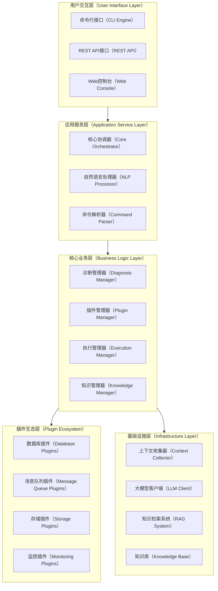

# KubeStack-AI Architecture

This document outlines the system architecture of KubeStack-AI, an intelligent SRE assistant for middleware.

## 1. Core Design Philosophy

KubeStack-AI is built on four core principles to systematically address the challenges of modern middleware management:

*   **Unified Abstraction Layer**: A standardized plugin interface allows diverse middleware systems (like Redis, MySQL, Kafka) to be managed through a single, consistent data model and set of operations. This achieves the goal of "one CLI to rule them all."
*   **AI-Driven Operations**: Integrates the powerful reasoning capabilities of Large Language Models (LLMs) with a structured, domain-specific knowledge base to provide natural language interaction, intelligent diagnostics, and automated problem-solving.
*   **Pluggable and Extensible**: A modular plugin system, inspired by frameworks like Terraform, allows the community to easily add support for new middleware and custom tools, ensuring the platform can adapt and grow.
*   **Multi-Environment Support**: Designed to operate seamlessly in both modern containerized Kubernetes environments and traditional bare-metal or VM-based setups, providing a consistent user experience regardless of the underlying infrastructure.

## 2. System Architecture

The system is designed with a layered architecture to ensure a clear separation of concerns, which enhances maintainability and scalability.

*   **User Interface (UI) Layer**: The entry point for users, including a Command-Line Interface (`ksa`), a REST API for programmatic access, and a potential Web Console for visual management.
*   **Application Service Layer**: Handles incoming requests, parses them, and delegates them to the business logic layer. The **Core Orchestrator** is the central component here, acting as the system's "brain."
*   **Business Logic Layer**: Contains the core engines of the application:
    *   **Plugin Manager**: Manages the lifecycle of all plugins (loading, unloading, discovery).
    *   **Diagnosis Manager**: Orchestrates the data collection and analysis process.
    *   **Execution Manager**: Manages the planning and execution of automated fixes.
    *   **Knowledge Manager**: Manages the interaction with the knowledge base.
*   **Plugin Ecosystem**: A collection of individual plugins for different middleware systems. Each plugin is a self-contained unit that adheres to the `MiddlewarePlugin` interface.
*   **Infrastructure Layer**: Provides foundational services, such as collecting context from the environment (Kubernetes, OS), interacting with LLM APIs, and the Retrieval-Augmented Generation (RAG) system for knowledge retrieval.

## 3. Component Deep Dive

### 3.1. Plugin System

The plugin system is the cornerstone of KubeStack-AI's extensibility.
*   **Plugin Manager**: Uses a `PluginRegistry` to discover available plugins (e.g., by scanning a directory for `plugin.yaml` manifest files) and a `PluginLoader` to load the plugin code (e.g., from a Go `.so` file).
*   **`MiddlewarePlugin` Interface**: Defines the standard contract all plugins must follow, with methods for `Diagnose`, `CollectMetrics`, `ExecuteFix`, etc. This ensures consistent behavior across all supported middleware.

### 3.2. Diagnosis Flow

The diagnosis process is orchestrated by the `DiagnosisManager` and follows these steps:
1.  The user runs `ksa diagnose redis my-redis`.
2.  The **Orchestrator** receives the request and calls the `DiagnosisManager`.
3.  The `DiagnosisManager` uses the `PluginManager` to load the appropriate (Redis) plugin.
4.  It invokes the `Collect...` methods on the plugin to gather data (e.g., `INFO`, `CONFIG`) in parallel.
5.  The collected data is passed to one or more `DiagnosisAnalyzer` components (e.g., a rule-based analyzer for common issues, an AI analyzer for complex problems).
6.  The analyzers return a list of identified issues, which are formatted into a final report for the user.

### 3.3. LLM and RAG Integration

For commands like `ksa ask`, the system uses a Retrieval-Augmented Generation (RAG) pipeline to provide accurate, context-aware answers:
1.  The user's query is sent to the **Orchestrator**.
2.  The **Retriever** component uses an **Embedder** to convert the query into a vector embedding.
3.  It searches the **Vector Store** (e.g., an in-memory store, ChromaDB) for the most relevant document chunks from the knowledge base.
4.  The **Prompt Builder** constructs a detailed prompt containing the original query and the retrieved documents as context.
5.  This "augmented" prompt is sent via the **LLM Client** (e.g., OpenAI, Gemini) to the language model.
6.  The LLM's response is streamed back to the user through the CLI.

## 4. Architectural Decisions & Trade-offs

*   **Interface-Driven Design**: Core components (Orchestrator, Managers, Plugins, Stores) are defined by interfaces. This promotes loose coupling and testability. It allows for multiple implementations (e.g., an in-memory vector store for testing and a production-grade ChromaDB store) that can be swapped out with minimal code changes.
*   **Decoupled LLM Clients**: By using a common `LLMClient` interface, the application can easily switch between different LLM providers (OpenAI, Gemini, local models) without changing the core application logic. This avoids vendor lock-in.
*   **Local-First Knowledge**: The default implementation uses a local, file-based registry and in-memory stores. This allows KubeStack-AI to run standalone without external dependencies, which is crucial for air-gapped or simplified environments. Production deployments can be configured to use more robust, distributed stores.

<!-- Personal.AI order the ending -->
