# KubeStack-AI 架构设计

## 概览

KubeStack-AI 是一个基于人工智能的统一中间件管理平台，旨在解决云原生环境中中间件运维的复杂性和碎片化问题。本文档详细阐述了项目的技术架构、设计决策和实现策略。

### 架构愿景

传统的中间件运维面临着工具分散、专业知识要求高、故障排查复杂等挑战。KubeStack-AI 通过统一的智能接口，整合了多种中间件的运维能力，提供从诊断分析到自动修复的完整解决方案。

### 核心设计原则

- **统一性**：单一 CLI 工具管理所有中间件
- **智能化**：AI 驱动的诊断和决策能力
- **可扩展性**：插件化架构支持新中间件接入
- **可靠性**：企业级稳定性和错误处理
- **可观测性**：全面的监控和追踪能力

## 系统架构概览

### 整体架构图

```mermaid
graph TB
    %% 用户交互层
    subgraph UI[用户交互层（User Interface Layer）]
        CLI[命令行接口（CLI Interface）]
        API[REST API 接口（REST API）]
        WEB[Web 控制台（Web Console）]
    end

    %% 应用层
    subgraph APP[应用层（Application Layer）]
        CMD[命令处理器（Command Handler）]
        ORCH[编排引擎（Orchestrator）]
        AUTH[认证授权（Authentication）]
    end

    %% 核心服务层
    subgraph CORE[核心服务层（Core Services Layer）]
        DIAG[诊断引擎（Diagnostic Engine）]
        AI[AI 服务（AI Service）]
        PLUGIN[插件管理器（Plugin Manager）]
        CONFIG[配置管理（Config Manager）]
    end

    %% 插件层
    subgraph PLUGINS[插件层（Plugin Layer）]
        REDIS[Redis 插件（Redis Plugin）]
        MYSQL[MySQL 插件（MySQL Plugin）]
        KAFKA[Kafka 插件（Kafka Plugin）]
        ELASTIC[ES 插件（ElasticSearch Plugin）]
        OTHER[其他插件（Other Plugins）]
    end

    %% 基础设施层
    subgraph INFRA[基础设施层（Infrastructure Layer）]
        K8S[Kubernetes API]
        METRICS[指标收集（Metrics Collection）]
        LOGS[日志聚合（Log Aggregation）]
        STORAGE[存储服务（Storage Service）]
    end

    %% 外部系统
    subgraph EXT[外部系统（External Systems）]
        LLM[大语言模型（LLM Providers）]
        MIDDLEWARE[中间件实例（Middleware Instances）]
        MONITOR[监控系统（Monitoring Systems）]
    end

    %% 连接关系
    CLI --> CMD
    API --> CMD
    WEB --> API
    
    CMD --> ORCH
    ORCH --> AUTH
    ORCH --> DIAG
    ORCH --> AI
    ORCH --> PLUGIN
    ORCH --> CONFIG
    
    DIAG --> PLUGINS
    AI --> LLM
    PLUGIN --> PLUGINS
    
    PLUGINS --> INFRA
    INFRA --> MIDDLEWARE
    INFRA --> K8S
    INFRA --> MONITOR
    
    METRICS --> INFRA
    LOGS --> INFRA
````

### 数据流架构图

```mermaid
sequenceDiagram
    participant U as 用户（User）
    participant CLI as CLI 接口
    participant O as 编排引擎（Orchestrator）
    participant PM as 插件管理器（Plugin Manager）
    participant P as 中间件插件（Plugin）
    participant CC as 上下文收集器（Context Collector）
    participant AI as AI 服务（AI Service）
    participant LLM as 大语言模型（LLM）
    participant E as 执行引擎（Execution Engine）

    U->>CLI: 1. 输入自然语言指令<br/>"检查 Redis 性能问题"
    CLI->>O: 2. 解析命令与参数
    O->>PM: 3. 加载 Redis 插件
    PM-->>O: 4. 返回插件实例
    
    O->>P: 5. 调用插件诊断方法
    P->>CC: 6. 收集系统上下文
    CC-->>P: 7. 返回指标、日志、配置
    P-->>O: 8. 返回结构化诊断数据
    
    O->>AI: 9. 请求 AI 分析
    AI->>LLM: 10. 构造提示并发送
    LLM-->>AI: 11. 返回分析结果
    AI-->>O: 12. 结构化分析报告
    
    O->>U: 13. 展示诊断结果
    
    alt 用户确认修复
        U->>CLI: 14. 确认执行修复
        CLI->>O: 15. 触发修复流程
        O->>E: 16. 执行修复命令
        E-->>O: 17. 返回执行结果
        O->>U: 18. 展示修复结果
    end
```

## 核心组件详解

### CLI 引擎（CLI Engine）

CLI 引擎基于 Cobra 框架构建，提供灵活的命令行接口和参数处理能力。

**核心职责：**

* 命令解析与验证
* 用户交互管理
* 输出格式化与美化
* 错误信息展示

**主要命令结构：**

```
kubestack-ai
├── init          # 初始化配置
├── config        # 配置管理
├── plugin        # 插件管理
├── analyze       # 自然语言分析
├── diagnose      # 结构化诊断
├── health        # 健康检查
├── optimize      # 优化建议
├── security      # 安全审计
├── fix           # 自动修复
└── interactive   # 交互模式
```

### 编排引擎（Orchestrator）

编排引擎是系统的核心协调器，负责整个诊断和修复流程的管理。

**核心职责：**

* 请求路由与分发
* 插件生命周期管理
* 工作流程编排
* 结果聚合与处理
* 错误处理与重试

**工作流程：**

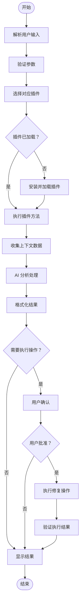
继续完善 docs/architecture.md 文档：

### 插件接口（Plugin Interface）

插件系统是 KubeStack-AI 可扩展性的核心，每个中间件插件必须实现统一的接口规范。

**核心接口定义：**

```go
type MiddlewarePlugin interface {
    // 基础信息
    Name() string
    Version() string
    SupportedVersions() []string
    
    // 生命周期管理
    Initialize(ctx context.Context, config *PluginConfig) error
    Cleanup() error
    
    // 核心功能
    Diagnose(ctx context.Context, req *DiagnoseRequest) (*DiagnoseResult, error)
    Analyze(ctx context.Context, data *ContextData) (*AnalysisResult, error)
    Repair(ctx context.Context, action *RepairAction) (*RepairResult, error)
    
    // 健康检查
    HealthCheck(ctx context.Context) (*HealthStatus, error)
    
    // 配置验证
    ValidateConfig(config map[string]interface{}) error
}
```

**插件生命周期管理：**

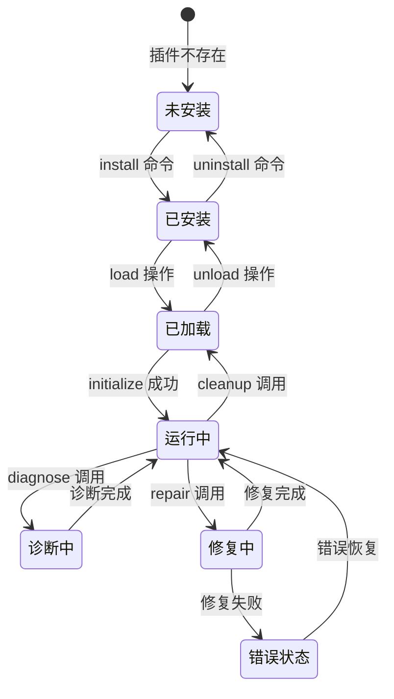

### 上下文收集器（Context Collector）

上下文收集器负责从多个数据源收集中间件运行时信息。

**数据收集源：**

* Kubernetes API（Pod 状态、资源使用）
* 中间件原生 API（特定指标、配置）
* 系统级监控（CPU、内存、磁盘、网络）
* 日志聚合系统（错误日志、性能日志）
* 配置文件（运行参数、安全设置）

**收集策略：**

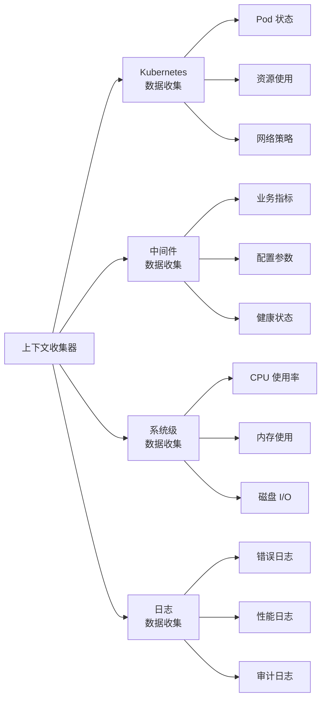

### AI 服务（AI Service）

AI 服务负责与大语言模型的交互，提供智能分析和决策能力。

**核心功能：**

* 提示工程（Prompt Engineering）
* 上下文理解与推理
* 结果结构化处理
* 多轮对话支持

**LLM 交互模型：**

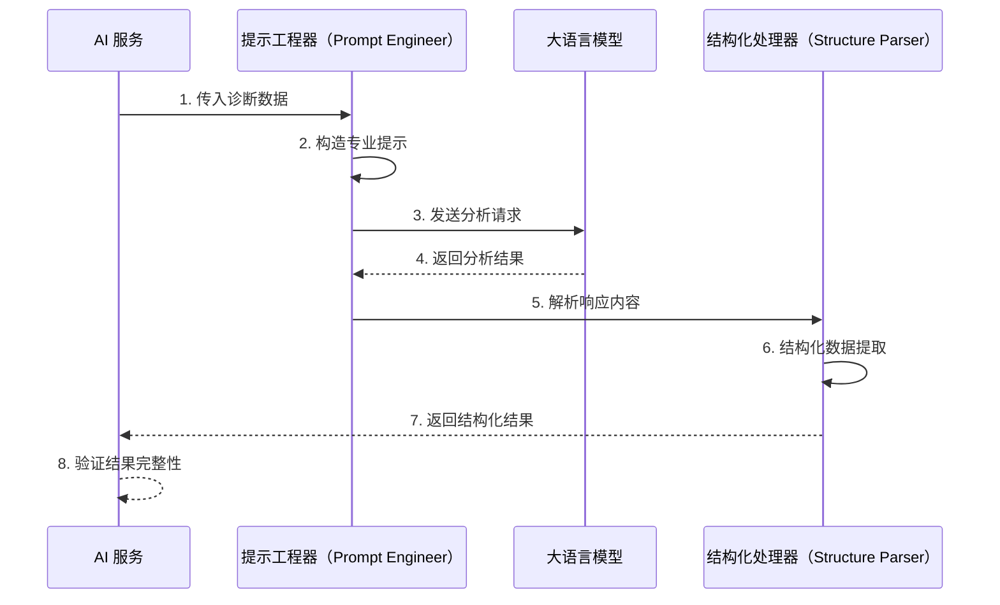

## 插件架构深度解析

### 插件发现与注册机制

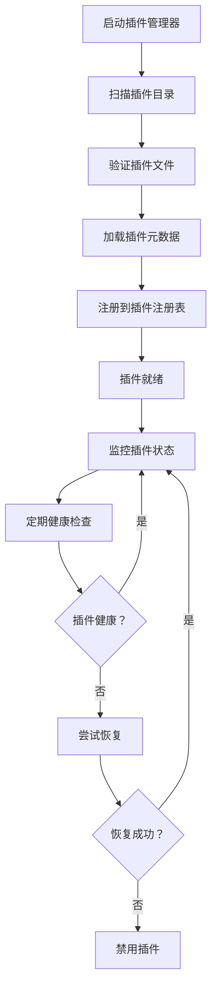

### 数据收集接口标准

每个插件必须实现标准的数据收集接口：

```json
{
  "collectMetrics": {
    "description": "收集中间件性能指标",
    "returns": {
      "cpu_usage_percent": "number",
      "memory_usage_bytes": "number",
      "disk_io_read_bps": "number",
      "disk_io_write_bps": "number",
      "network_rx_bps": "number",
      "network_tx_bps": "number",
      "custom_metrics": "object"
    }
  },
  "collectLogs": {
    "description": "收集最新日志条目",
    "parameters": {
      "lines": "number",
      "level": "string",
      "since": "timestamp"
    },
    "returns": {
      "logs": "array",
      "total_count": "number"
    }
  },
  "collectConfig": {
    "description": "收集运行时配置",
    "returns": {
      "runtime_config": "object",
      "static_config": "object",
      "environment_vars": "object"
    }
  }
}
```

## 配置管理架构

### 配置层次结构

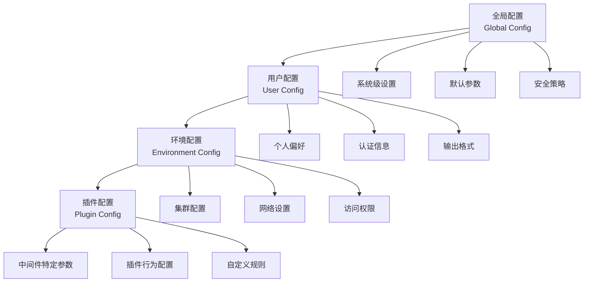

### 配置优先级与合并策略

配置项按以下优先级顺序应用：

1. 命令行参数（最高优先级）
2. 环境变量
3. 用户配置文件
4. 系统默认配置（最低优先级）

## 错误处理与可靠性设计

### 错误分类与处理策略

| 错误类型     | 处理策略          | 用户体验     |
| -------- | ------------- | -------- |
| 网络连接错误   | 自动重试 3 次，指数退避 | 显示重试进度   |
| 认证失败     | 立即终止，提示重新认证   | 清晰的错误说明  |
| 插件加载失败   | 跳过该插件，记录警告    | 显示可用替代方案 |
| AI 服务不可用 | 降级到规则引擎       | 提示功能受限   |
| 数据格式错误   | 数据清理和标准化      | 显示数据质量警告 |

### 错误恢复机制

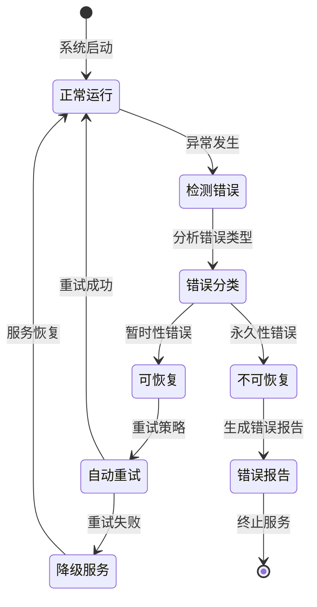

## 性能优化策略

### 缓存架构设计

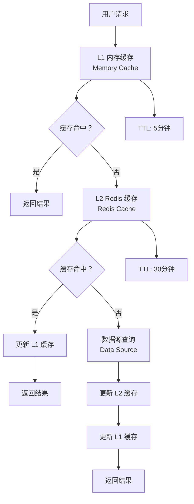

### 并发处理优化

* **连接池管理**：复用 Kubernetes API 连接
* **批量操作**：聚合多个资源查询
* **异步处理**：后台任务队列
* **流式处理**：大数据集分块传输

## 安全架构设计

### 认证与授权流程

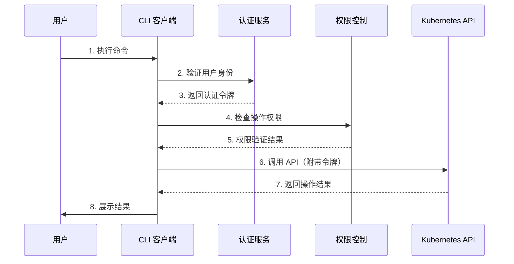

### 数据安全保护

* **敏感数据加密**：API 密钥、数据库密码等
* **传输安全**：TLS 加密所有网络通信
* **审计日志**：记录所有操作和访问
* **权限最小化**：最小必要权限原则

## 监控与可观测性

### 系统监控指标

| 指标类别 | 具体指标         | 采集频率 | 存储期限 |
| ---- | ------------ | ---- | ---- |
| 性能指标 | 响应时间、吞吐量、错误率 | 30 秒 | 90 天 |
| 资源使用 | CPU、内存、磁盘、网络 | 1 分钟 | 30 天 |
| 业务指标 | 诊断次数、修复成功率   | 5 分钟 | 1 年  |
| 用户行为 | 命令使用频率、功能覆盖率 | 实时   | 6 个月 |

### 分布式追踪

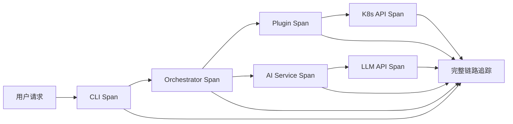

## 项目目录结构

```
kubestack-ai/
├── cmd/                          # 应用程序入口
│   └── kubestack-ai/            # 主程序
├── internal/                     # 内部包（不对外暴露）
│   ├── common/                   # 公共组件
│   │   ├── types/               # 公共类型定义
│   │   ├── errors/              # 错误定义
│   │   ├── constants/           # 常量定义
│   │   ├── logger/              # 日志组件
│   │   └── utils/               # 工具函数
│   ├── config/                   # 配置管理
│   ├── core/                     # 核心业务逻辑
│   │   ├── orchestrator/        # 编排引擎
│   │   ├── plugin/              # 插件管理
│   │   ├── ai/                  # AI 服务
│   │   ├── context/             # 上下文收集
│   │   └── executor/            # 执行引擎
│   ├── cli/                      # CLI 实现
│   ├── api/                      # API 服务器（可选）
│   └── plugins/                  # 内置插件
│       ├── redis/
│       ├── mysql/
│       ├── kafka/
│       └── elasticsearch/
├── pkg/                          # 可被外部引用的包
│   ├── client/                   # 客户端库
│   ├── plugin/                   # 插件开发 SDK
│   └── types/                    # 公共类型
├── docs/                         # 文档
│   ├── architecture.md
│   ├── plugins.md
│   └── api.md
├── deployments/                  # 部署配置
│   ├── kubernetes/
│   └── docker/
├── scripts/                      # 构建和部署脚本
├── tests/                        # 测试文件
│   ├── integration/
│   └── e2e/
├── examples/                     # 示例配置
├── assets/                       # 静态资源
├── go.mod                        # Go 模块定义
├── go.sum                        # 依赖锁定
├── Makefile                      # 构建脚本
├── Dockerfile                    # 容器构建
├── README.md                     # 项目说明
├── README-zh.md                  # 中文说明
├── LICENSE                       # 开源协议
└── CONTRIBUTING.md               # 贡献指南
```

## 开发工作流程

### 代码开发流程

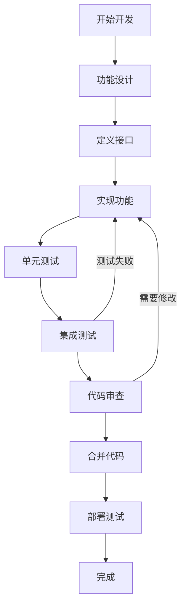

### 质量保证措施

* **代码规范**：使用 golangci-lint 进行代码检查
* **测试覆盖率**：要求 >80% 的测试覆盖率
* **性能测试**：关键路径性能基准测试
* **安全扫描**：使用 gosec 进行安全漏洞扫描

## 部署架构

### 容器化部署

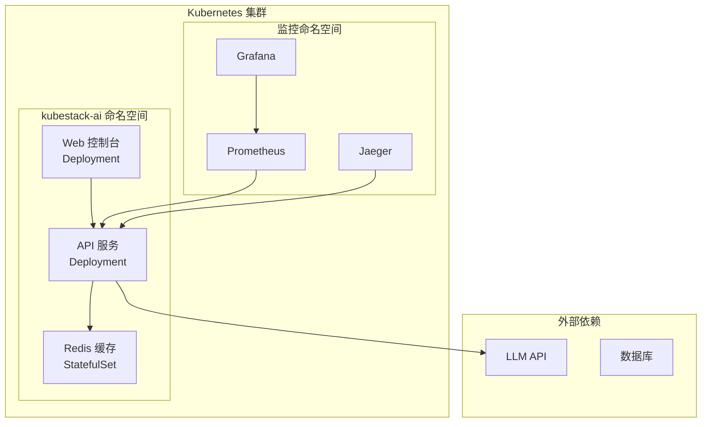

### 高可用性设计

* **多副本部署**：核心服务至少 3 个副本
* **负载均衡**：使用 Kubernetes Service 和 Ingress
* **健康检查**：完善的存活性和就绪性探针
* **优雅关闭**：处理 SIGTERM 信号，完成正在进行的任务
* **数据持久化**：重要数据使用持久卷存储

## 扩展性考虑

### 水平扩展策略

* **无状态设计**：核心服务保持无状态
* **缓存外置**：使用 Redis 作为共享缓存
* **数据库分片**：大数据量时支持分库分表
* **CDN 加速**：静态资源使用 CDN 分发

### 插件生态发展

* **插件市场**：提供插件发现和分发平台
* **开发者工具**：完善的插件开发 SDK
* **社区贡献**：鼓励开源社区贡献插件
* **质量认证**：插件质量评级和认证机制

## 参考资料

* \[1] k8sgpt-ai 项目 - [https://github.com/k8sgpt-ai/k8sgpt](https://github.com/k8sgpt-ai/k8sgpt)
* \[2] kubectl-ai 项目 - [https://github.com/GoogleCloudPlatform/kubectl-ai](https://github.com/GoogleCloudPlatform/kubectl-ai)
* \[3] Kubernetes API 参考 - [https://kubernetes.io/docs/reference/](https://kubernetes.io/docs/reference/)
* \[4] OpenAI API 文档 - [https://platform.openai.com/docs/](https://platform.openai.com/docs/)
* \[5] Cobra CLI 框架 - [https://github.com/spf13/cobra](https://github.com/spf13/cobra)
* \[6] Go 语言最佳实践 - [https://golang.org/doc/effective\_go](https://golang.org/doc/effective_go)
