# KubeStack-AI Architecture

## Overview

KubeStack-AI is built on a modular, plugin-based architecture that enables extensible middleware management through AI-powered natural language interfaces. The system consists of five core components that work together to provide intelligent diagnosis, analysis, and repair capabilities for Kubernetes middleware services.

## System Architecture Diagram

```mermaid
graph LR
    User[👤 User] --> CLI[🖥️ CLI Engine<br/>Cobra + Viper]
    
    CLI --> Orchestrator[🎯 Orchestrator<br/>Core Logic Engine]
    
    Orchestrator --> PluginManager[🔌 Plugin Manager<br/>Dynamic Loading]
    Orchestrator --> ContextCollector[📊 Context Collector<br/>Data Gathering]
    Orchestrator --> LLMClient[🤖 LLM Client<br/>AI Integration]
    
    PluginManager --> RedisPlugin[Redis Plugin]
    PluginManager --> KafkaPlugin[Kafka Plugin]
    PluginManager --> PostgresPlugin[PostgreSQL Plugin]
    PluginManager --> MinIOPlugin[MinIO Plugin]
    
    ContextCollector --> K8sAPI[☸️ Kubernetes API<br/>Pods, Services, Events]
    ContextCollector --> MetricsAPI[📈 Metrics API<br/>Prometheus/Built-in]
    ContextCollector --> LogsAPI[📋 Logs API<br/>Container Logs]
    
    RedisPlugin --> RedisService[Redis Service]
    KafkaPlugin --> KafkaService[Kafka Service]
    PostgresPlugin --> PostgresService[PostgreSQL Service]
    MinIOPlugin --> MinIOService[MinIO Service]
    
    LLMClient --> OpenAI[OpenAI API]
    LLMClient --> Claude[Claude API]
    LLMClient --> LocalLLM[Local LLM]
```



## Core Components

### 1. CLI Engine (Cobra Framework)

The CLI Engine serves as the primary user interface, built on the robust Cobra framework with Viper for configuration management.

**Responsibilities:**

* Parse user commands and natural language input
* Validate command arguments and flags
* Route requests to the appropriate orchestrator workflow
* Format and display results to users
* Handle configuration management and persistence

**Key Commands:**

* `ksai diagnose "natural language problem description"`
* `ksai analyze <service> --namespace <ns> --detailed`
* `ksai repair <service> --issue <description> --confirm`
* `ksai config set/get/verify`
* `ksai health-check --all-services`

**Configuration Hierarchy:**

1. Command-line flags (highest priority)
2. Environment variables
3. Configuration file (`~/.kubestack-ai/config.yaml`)
4. Default values (lowest priority)

### 2. Orchestrator (Core Logic Engine)

The Orchestrator is the central brain of KubeStack-AI, responsible for coordinating all system components and managing the complete workflow from user input to actionable output.

**Key Responsibilities:**

* **Natural Language Processing**: Parse and understand user intent from natural language descriptions
* **Workflow Management**: Coordinate the execution flow between plugins, collectors, and LLM services
* **Context Correlation**: Combine data from multiple sources to build comprehensive service context
* **Result Synthesis**: Aggregate plugin outputs and LLM analysis into coherent recommendations
* **Error Handling**: Gracefully handle failures and provide meaningful error messages

**Core Workflows:**

1. **Diagnostic Workflow:**

   ```
   User Input → Intent Parsing → Plugin Selection → Context Collection → 
   Data Analysis → LLM Processing → Result Formatting → User Output
   ```

2. **Analysis Workflow:**

   ```
   Service Identification → Plugin Loading → Health Checks → 
   Performance Metrics → Issue Detection → Recommendation Generation
   ```

3. **Repair Workflow:**

   ```
   Problem Validation → Solution Planning → User Confirmation → 
   Command Execution → Result Verification → Status Reporting
   ```

### 3. Plugin Interface & Management

KubeStack-AI's extensibility comes from its robust plugin architecture. Each middleware service is supported through a standardized plugin interface that ensures consistency while allowing for service-specific implementations.

**Plugin Interface Definition:**

```go
type MiddlewarePlugin interface {
    // Plugin Metadata
    Name() string
    Version() string
    SupportedServices() []string
    
    // Core Operations
    Initialize(config *Config) error
    Diagnose(ctx context.Context, request *DiagnoseRequest) (*DiagnoseResponse, error)
    Analyze(ctx context.Context, request *AnalyzeRequest) (*AnalyzeResponse, error)
    Repair(ctx context.Context, request *RepairRequest) (*RepairResponse, error)
    HealthCheck(ctx context.Context, request *HealthCheckRequest) (*HealthCheckResponse, error)
    
    // Configuration & Lifecycle
    ValidateConfig(config *Config) error
    Shutdown() error
}
```

**Plugin Lifecycle:**

1. **Discovery**: Plugins are discovered via configuration or directory scanning
2. **Loading**: Dynamic loading of plugin binaries or modules
3. **Initialization**: Plugin setup with service-specific configuration
4. **Registration**: Plugin capabilities registered with the orchestrator
5. **Execution**: Plugin methods called during workflow execution
6. **Cleanup**: Proper shutdown and resource cleanup

**Plugin Manager Responsibilities:**

* Dynamic plugin loading and unloading
* Version compatibility checking
* Plugin registry maintenance
* Dependency resolution
* Configuration validation

### 4. Context Collector (Data Gathering Engine)

The Context Collector is responsible for gathering comprehensive information about the Kubernetes environment and middleware services to provide rich context for AI analysis.

**Data Sources:**

1. **Kubernetes API Integration:**

   * Pod status, events, and resource utilization
   * Service endpoints and network configurations
   * ConfigMaps and Secrets (metadata only)
   * Node health and capacity information
   * Ingress and networking rules

2. **Metrics Collection:**

   * Prometheus metrics when available
   * Kubernetes built-in metrics (CPU, memory, network, storage)
   * Service-specific metrics via plugin interfaces
   * Custom metrics from application exporters

3. **Log Aggregation:**

   * Container logs for targeted pods
   * Kubernetes events and system logs
   * Service-specific log parsing via plugins
   * Error pattern detection and categorization

**Collection Strategies:**

* **Targeted Collection**: Focus on specific services based on user queries
* **Contextual Expansion**: Automatically include related services and dependencies
* **Time-bounded Collection**: Gather data within relevant time windows
* **Filtered Collection**: Apply filters to reduce noise and focus on relevant data

### 5. LLM Interaction Client

The LLM Client provides a flexible interface for integrating with various Large Language Model services, enabling the AI-powered analysis that makes KubeStack-AI intelligent.

**Supported LLM Providers:**

* **OpenAI GPT-4/GPT-3.5**: Industry-leading language models
* **Anthropic Claude**: Advanced reasoning and analysis capabilities
* **Local Models**: Support for self-hosted models via OpenAI-compatible APIs
* **Azure OpenAI**: Enterprise-ready OpenAI integration

**LLM Client Features:**

* **Provider Abstraction**: Unified interface across different LLM services
* **Context Optimization**: Intelligent prompt construction and context management
* **Response Parsing**: Structured extraction of recommendations and commands
* **Cost Management**: Token usage tracking and optimization
* **Fallback Handling**: Graceful degradation when primary LLM is unavailable

**Prompt Engineering:**

* **Service-Specific Prompts**: Tailored prompts for different middleware types
* **Context Templates**: Standardized formats for presenting collected data
* **Few-Shot Learning**: Example-based prompting for consistent outputs
* **Chain of Thought**: Multi-step reasoning for complex problems

## Plugin Lifecycle Management

### Plugin Discovery and Loading

1. **Static Configuration**: Plugins defined in configuration files
2. **Directory Scanning**: Automatic discovery from plugin directories
3. **Dynamic Loading**: Runtime loading of plugin binaries
4. **Compatibility Verification**: Version and API compatibility checks

### Plugin Execution Model

Each plugin operates within a well-defined execution context:

1. **Initialization Phase**: Plugin setup with service configuration
2. **Context Preparation**: Service-specific data collection
3. **Analysis Phase**: Plugin-specific logic execution
4. **Result Processing**: Output standardization and validation
5. **Cleanup Phase**: Resource cleanup and state persistence

### Error Handling and Recovery

* **Graceful Degradation**: System continues operation when individual plugins fail
* **Error Propagation**: Structured error reporting with context
* **Retry Logic**: Automatic retry for transient failures
* **Fallback Mechanisms**: Alternative analysis methods when plugins are unavailable

## Configuration Management

KubeStack-AI uses a hierarchical configuration system that supports both global settings and service-specific configurations.

### Configuration Structure

```yaml
# Global Configuration
global:
  log_level: info
  output_format: table
  kubernetes:
    config_path: ~/.kube/config
    context: default
  
# LLM Configuration
llm:
  provider: openai
  api_key: ${OPENAI_API_KEY}
  model: gpt-4
  max_tokens: 4000
  temperature: 0.1

# Plugin Configuration
plugins:
  redis:
    enabled: true
    timeout: 30s
    cli_path: /usr/local/bin/redis-cli
  kafka:
    enabled: true
    timeout: 45s
    admin_timeout: 60s
  postgres:
    enabled: true
    timeout: 30s
    query_timeout: 15s
```

### Configuration Sources Priority

1. **Command-line flags** (highest precedence)
2. **Environment variables**
3. **Configuration file**
4. **Default values** (lowest precedence)

### Dynamic Configuration Updates

* **Hot Reloading**: Configuration changes without service restart
* **Validation**: Real-time configuration validation
* **Rollback**: Automatic rollback on invalid configurations
* **Audit Trail**: Configuration change logging

## Security Considerations

### Authentication and Authorization

* **Kubernetes RBAC Integration**: Respect existing Kubernetes permissions
* **Service Account Support**: Operate within defined service account constraints
* **API Key Management**: Secure storage and rotation of LLM API keys
* **Audit Logging**: Comprehensive logging of all operations

