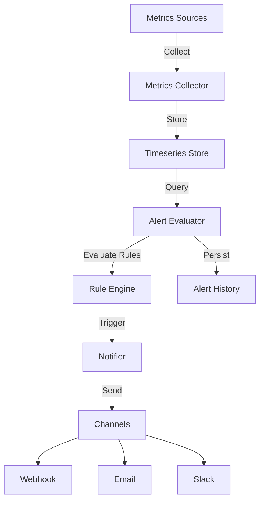

# Monitoring and Alerting System (P7)

## Overview

The KubeStack-AI Monitoring and Alerting System provides real-time visibility into the health and performance of your infrastructure and middleware components. It includes a flexible metrics collection framework, a rule-based alerting engine, and multi-channel notification support.

## Architecture



## Configuration

The monitoring system is configured via the main `config.yaml` file under the `monitor` section.

### Example Configuration

```yaml
monitor:
  collection:
    interval: 30s
    retention: 7d
    sources:
      - type: kubernetes
        enabled: true
        kubeconfig: ~/.kube/config
      - type: middleware
        enabled: true
        middlewares: [redis-1, mysql-prod]

  alerting:
    enabled: true
    evaluation_interval: 1m
    notifiers:
      - type: webhook
        name: default-webhook
        enabled: true
        url: https://hooks.example.com/alerts
        timeout: 10s
      - type: email
        name: ops-email
        enabled: true
        smtp:
          host: smtp.gmail.com
          port: 587
          username: alerts@example.com
          password: secret-password
          from: alerts@example.com
        to: [ops@example.com]

    rules:
      - name: high-cpu-usage
        expr: "cpu_usage > 80"
        for: 5m
        severity: warning
        annotations:
          summary: "High CPU Usage"

  storage:
    type: sqlite
    path: ./data/metrics.db
```

## Alert Rules DSL

Alert rules use a simple expression syntax: `metric_name operator value`.

*   `metric_name`: The name of the metric to check (e.g., `cpu_usage`, `redis_memory`).
*   `operator`: one of `>`, `>=`, `<`, `<=`, `==`, `!=`.
*   `value`: The numeric threshold.

Example: `redis_memory_usage_bytes > 104857600` (100MB)

## API Reference

See `docs/api/monitoring.md` for details on the monitoring APIs.

## CLI Commands

*   `ksa monitor status`: Check system status.
*   `ksa monitor metrics <type>`: Query real-time metrics.
*   `ksa alert list`: List active alerts.
*   `ksa alert silence <rule_name> <duration>`: Silence an alert.
